# Advanced Conditional Access - Deep Drive

## Conditional Access

### Help defining an enterprise framework

**엔터프라이즈 프레임워크 정의 지원**

조건부 액세스(Conditional Access) 정책은 가장 단순하게 말하면 *if-then* 구조의 문장입니다. 즉, 사용자가 어떤 리소스에 접근하려고 하면, 그에 따라 특정 작업을 수행해야 합니다.예를 들어: 사용자가 Microsoft 365 같은 애플리케이션이나 서비스에 접근하려면, 접근을 위해 다단계 인증(MFA)을 수행해야 합니다.

관리자는 두 가지 주요 목표에 직면합니다:

- 사용자가 언제 어디서나 생산적으로 일할 수 있도록 지원하기
- 조직의 자산을 보호하기

조건부 액세스 정책을 사용하면 필요한 시점에 적절한 액세스 제어를 적용하여 조직을 안전하게 보호할 수 있습니다.

**구조화된 프레임워크(Structured Framework)**를 따르는 것은 정책을 이해하기 쉽게 만들어 줍니다. 또한 모든 시나리오를 빠짐없이 다루고, 문제 해결이 어려운 충돌 정책을 피하는 데에도 도움이 됩니다.

이번 VBD에서는 고급 시나리오를 다룰 예정이지만, 고객의 현재 환경을 반드시 확인해야 합니다. 특히 다음과 같은 항목을 점검하며, 고객이 구조화된 프레임워크를 사용하고 있는지, 그리고 관련 주제를 다시 상기할 필요가 있는지 확인해야 합니다:

    - 사용자 환경 구성 방식
    - 현재 적용 중인 조건부 액세스 정책 구조
    - 정책 간 충돌 여부

- **명명 규칙(Naming convention):** 표준화된 명명 규칙을 사용하면 Azure 관리자 포털을 열어보지 않아도 정책을 쉽게 찾고 목적을 이해할 수 있습니다. 권장되는 명명 형식에는 다음 요소를 포함하는 것입니다:

    - 순서 번호 (A Sequence Number)
    - 적용되는 클라우드 앱 (The cloud app(s) it applies to)
    - 정책의 동작(The response)
    - 적용 대상(Who it applies to)
    - 적용 시점(When it applies (if applicable))

- **템플릿:** Microsoft 권장 사항에 맞춘 새로운 정책을 손쉽게 배포할 수 있는 편리한 방법입니다.

    템플릿을 배포하면, 템플릿을 배포하는 사용자 계정은 자동으로 정책에서 제외됩니다.

    > [!NOTE]
    > 2023년 11월 6일부터 Microsoft는 특정 기준(위험 신호, 현재 사용 상태, 라이선스)을 충족하는 테넌트에 3개의 Microsoft 관리 조건부 액세스 정책(Microsoft Managed Conditional Access Policies)을 자동 배포했습니다. 자세한 내용은 관련 문서를 참고하세요.
    > 
    > 📌 FY24 적용 정책 (3가지)
    > 
    > - **관리자 포털 MFA 요구** 관리자 역할 계정이 Microsoft 관리 포털 로그인 시 MFA 필수
    > - **Per-user MFA 사용자 대상 MFA 요구** 기존 per-user MFA 사용자에게 모든 클라우드 앱에서 MFA 요구
    > - **고위험 로그인 MFA 요구** 고위험 로그인 시 MFA 및 재인증 요구

Protect your administrators: remember that Conditional Access policies support built-in roles. Conditional Access policies are not enforced for other role types including administrative unit-scoped or custom roles.

- **관리자를 보호하세요:**

    조건부 액세스 정책은 **기본 제공 역할(built‑in roles)** 을 지원한다는 점을 기억해야 합니다. 조건부 액세스 정책은 **관리 단위 범위 역할(AU‑scoped roles)** 이나 **커스텀 역할(custom roles)** 과 같은 다른 유형의 역할에는 적용되지 않습니다.

- **Authentication methods (인증 방법)**

    모든 MFA가 동일한 것은 아니라는 점을 기억해야 합니다.

    SMS나 음성 통화 같은 레거시 MFA 방식은 Microsoft Authenticator 앱이나 FIDO2 등과 비교했을 때 보안 수준이 낮습니다.

    [Authentication methods and features](https://learn.microsoft.com/en-us/entra/identity/authentication/concept-authentication-methods#authentication-method-strength-and-security)

- **사용자에게 안내하고 등록을 유도하는 방법**

    - 사용자에게 정보를 제공하기 위한 유용한 커뮤니케이션 템플릿은 다음에서 확인할 수 있습니다:
    
        - Microsoft 공식 다운로드 센터 – [Download Entra templates from Official Microsoft Download Center](https://www.microsoft.com/en-us/download/details.aspx?id=57600)  
        
        - 대규모 MFA 도입을 성공적으로 진행하려면 **커뮤니케이션이 핵심**입니다.
    
    - 사용자 등록을 관리하기 위해 다음 기능을 활용할 수 있습니다:

        - Registration Campaign(등록 캠페인)
        
            별도의 라이선스가 필요하지 않습니다.
        
            덜 안전한 인증 방식을 사용 중인 경우, 사용자가 Microsoft Authenticator 앱을 등록하도록 유도합니다.
        
        - MFA 등록 정책을 활용한 첫 등록 안내
        
            [MFA registration policy](https://learn.microsoft.com/en-us/entra/id-protection/howto-identity-protection-configure-mfa-policy)
            
            MFA 등록 정책을 사용하여 사용자가 다음번 대화형 로그인 시 등록하도록 안내할 수 있습니다.
            
            사용자는 14일 동안 등록을 완료할 수 있는 기간이 주어집니다. 이 14일 동안 MFA가 필수 조건이 아니라면 등록을 건너뛸 수 있습니다. 하지만 14일이 지나면 등록을 완료해야만 로그인 절차를 마칠 수 있습니다.
        
        - 인증 방법 등록 자체도 보호해야 함
        
            인증 방법을 등록하는 행위는 매우 민감하므로 반드시 보호해야 합니다. 이를 위해 다음 템플릿을 활용할 수 있습니다:
            
            [Control security information registration with Conditional Access](https://learn.microsoft.com/en-us/entra/identity/conditional-access/howto-conditional-access-policy-registration)

---

### Automation via PowerShell

Microsoft Graph를 사용하면 환경의 다른 코드와 마찬가지로 조건부 액세스 정책을 다룰 수 있습니다. [Conditional Access APIs](https://learn.microsoft.com/en-us/graph/api/resources/conditionalaccesspolicy?view=graph-rest-1.0)를 활용해 정책을 대규모로 관리할 수 있습니다.

> [!WARNING]
>제공된 예제는 지원 없이 있는 그대로 제공됩니다. 자동화를 직접 구축할 수 있으며, 필요하다면 Microsoft Graph의 [conditionalAccessRoot resource type - Microsoft Graph](https://learn.microsoft.com/en-us/graph/api/resources/conditionalaccessroot?view=graph-rest-1.0) 리소스 유형을 참고해 주세요.

---

### Authentication methods

인증 방법([Authentication methods](https://learn.microsoft.com/en-us/entra/identity/authentication/concept-authentication-methods))은 사용자가 애플리케이션과 리소스에 로그인할 때 자신의 신원을 증명하는 방식입니다. Microsoft Entra 다단계 인증(**multifactor authentication**)은 사용자가 로그인할 때 비밀번호만 사용하는 것보다 더 높은 보안을 제공합니다. 사용자는 추가 인증 수단(**additional forms of authentication**)을 요청받을 수 있으며, 예를 들어 푸시 알림에 응답하거나, 소프트웨어 또는 하드웨어 토큰에서 생성된 코드를 입력하거나, 문자 메시지 또는 전화에 응답하는 방식 등이 있습니다.

일부 인증 방법은 다른 방법보다 더 안전하며(**more secure than others**), 어떤 방법은 사용자에게 더 편리합니다(**more convenient**).

어떤 인증 방법을 사용자에게 제공할지 결정하는 것은 매우 중요한 단계입니다. 

레거시 인증 방법의 사용은 피하고(**avoid the usage of legacy authentication methods**), 보안성·사용성·가용성 측면에서 요구 사항을 충족하거나 초과하는 방법을 선택해야 합니다. 가능하다면 가장 높은(**highest**) 보안 수준([**level of security**](https://learn.microsoft.com/en-us/entra/identity/authentication/concept-authentication-methods#authentication-method-strength-and-security))을 제공하는 인증 방법을 사용하세요.

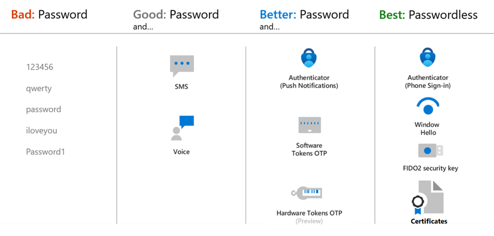


일부 인증 방법은 애플리케이션이나 디바이스에 로그인할 때 **기본 인증 요소(primary factor)**로 사용할 수 있습니다. 예를 들어 FIDO2 보안 키나 비밀번호가 이에 해당합니다. 

반면, 다른 인증 방법들은 Microsoft Entra 다단계 인증(MFA) 또는 SSPR을 사용할 때만 **보조 인증 요소(secondary factor)**로 사용할 수 있습니다.

***Ref: [How each authentication method works](https://learn.microsoft.com/en-us/entra/identity/authentication/concept-authentication-methods#how-each-authentication-method-works)***


인증 방법은 활성화하고 필요 시 구성해야 합니다. 현재는 **MFA와 SSPR 인증 방법을 관리하는 두 개의 별도 포털**이 존재합니다([Legacy MFA and SSPR policies](https://learn.microsoft.com/en-us/entra/identity/authentication/concept-authentication-methods-manage#legacy-mfa-and-sspr-policies)).

하지만 Microsoft는 이를 **새로운 통합 포털(Authentication methods policy)**로 전환하고 있습니다.

[Authentication methods policy](https://learn.microsoft.com/en-us/entra/identity/authentication/concept-authentication-methods-manage#authentication-methods-policy)

고객에게 반드시 알려야 할 중요한 사항은 다음과 같습니다.**2025년 9월 30일부로 레거시 MFA 및 SSPR 정책이 사용 중단(Deprecated)되며, 이후 모든 인증 방법 관리는 새로운 Authentication Methods Policy 포털에서 이루어지게 됩니다.**

따라서 고객은 이를 인지하고, 지금부터 **정책 간 마이그레이션 계획**을 수립해야 합니다.

***Ref: [Migration between policies](https://learn.microsoft.com/en-us/entra/identity/authentication/concept-authentication-methods-manage#migration-between-policies)***


#### Advanced settings

Microsoft Entra 다단계 인증(MFA)의 최종 사용자 경험을 사용자 지정하려면, **계정 잠금 임계값(account lockout thresholds)이나 사기 의심(Fraud) 경고 및 알림**과 같은 설정 옵션을 구성할 수 있습니다.

고객과의 대화에서 **의심스러운 활동 신고(Report suspicious activity)**, 즉 **Fraud Alert** 기능에 대해 언급하는 것이 좋습니다.

이 기능을 활성화하면 사용자가 로그인 과정에서 **의심스러운 활동을 직접 신고**할 수 있습니다.

***Ref: [Report suspicious activity](https://learn.microsoft.com/en-us/entra/identity/authentication/howto-mfa-mfasettings?utm_source=copilot.com#report-suspicious-activity)***

사용자가 의심스러운 활동을 신고하면 해당 사용자는 **고위험 사용자(High-risk users)** 목록과 **차단 목록(Blocklist)**에 자동으로 추가됩니다.

***Ref: [Report suspicious activity and fraud alert](https://learn.microsoft.com/en-us/entra/identity/authentication/howto-mfa-mfasettings?utm_source=copilot.com#report-suspicious-activity-and-fraud-alert)***

**[시스템 선호 다단계 인증(System-preferred MFA)](https://learn.microsoft.com/en-us/entra/identity/authentication/concept-system-preferred-multifactor-authentication?utm_source=copilot.com)**은 활성화할 수 있으며(기본값은 Microsoft 관리), 이를 통해 사용자에게 **가장 안전한 MFA 방법을 우선적으로 제시**할 수 있습니다.

가장 안전한 인증 방법이 어떻게 결정되는지 이해하려면 다음 링크를 참고하세요

***Ref: [How does system-preferred MFA determine the most secure method?](https://learn.microsoft.com/en-us/entra/identity/authentication/concept-system-preferred-multifactor-authentication?utm_source=copilot.com#how-does-system-preferred-mfa-determine-the-most-secure-method)***

---

### Impact and advanced reporting

Conditional Access 정책을 활성화하기 전에 영향도를 평가할 수 있도록 설계된 정책 상태인 [Report-only mode](https://learn.microsoft.com/en-us/entra/identity/conditional-access/concept-conditional-access-report-only)는 반드시 평가 목적으로만 사용해야 합니다.

Report-only 정책을 포함하여 Conditional Access 정책의 영향을 파악하기 위해서는 다음 도구들을 활용해야 합니다:

- [Conditional Access Insights and Reporting Workbook](https://learn.microsoft.com/en-us/entra/identity/conditional-access/howto-conditional-access-insights-reporting)

    개별 정책 또는 정책의 특정 하위 집합이 사용자 로그인에 어떤 영향을 미치는지 분석할 수 있습니다.

    > [!NOTE]
    >
    > **Prerequisites**
    >
    > - A Log Analytics workspace to retain sign-in logs data and access to that workspace.
    > - Microsoft Entra ID P1 licenses to use Conditional Access.

- [What-If Tool](https://learn.microsoft.com/en-us/entra/identity/conditional-access/what-if-tool)

    특정 시나리오를 검증하고 정책 적용 결과를 미리 확인할 수 있습니다.

- Entra ID의 Conditional Access 관련 기본 제공 워크북  

    정책 동작과 사용자 로그인 패턴을 시각적으로 분석하는 데 유용합니다.

    ***Ref: [How to use Microsoft Entra Workbooks](https://docs.microsoft.com/en-us/azure/active-directory/reports-monitoring/howto-use-azure-monitor-workbooks#sign-ins-by-conditional-access)***

    > [!NOTE]
    >
    > **Prerequisites**
    >
    > - A Microsoft Entra tenant with a [Premium P1 license](https://learn.microsoft.com/en-us/entra/fundamentals/get-started-premium)
    > - A Log Analytics workspace *and* access to that workspace
    > - The appropriate roles for Azure Monitor *and* Microsoft Entra ID

- Entra ID 로그인 로그(Sign-in logs) 내 CA 정책 상세 정보  

    각 로그인 이벤트에 대해 어떤 CA 정책이 적용되었는지, Report-only 결과는 무엇인지 확인할 수 있습니다.

    ***Ref: [Troubleshoot sign-in problems with Conditional Access](https://learn.microsoft.com/en-us/entra/identity/conditional-access/troubleshoot-conditional-access#policy-details)***

    > [!NOTE]
    >
    > 로그인 로그를 다운로드할 때는 **JSON** 형식을 선택해야 Conditional Access Report-only 결과 데이터가 포함됩니다.

- **[Microsoft Entra Sign-in diagnostics](https://learn.microsoft.com/en-us/entra/identity/monitoring-health/howto-use-sign-in-diagnostics?utm_source=copilot.com)**

     Entra ID에서 발생한 로그인 이벤트를 조사하고 문제를 분석하는 데 도움이 되는 도구입니다.

    - **사용자 경험 관련 언급:** **Flagging(플래그 지정)** 기능을 활성화하면, 사용자가 브라우저에서 로그인 시도 중 인증 오류를 경험한 경우, 그 시점부터 **20분 동안** 동일한 브라우저와 동일한 클라이언트 디바이스에서 발생하는 모든 로그인 이벤트에 대해 **Sign-ins 보고서에 “Flagged for Review: Yes”**가 표시됩니다.20분이 지나면 플래그는 자동으로 해제됩니다.
    
    ***Ref: [Flagged sign-ins](https://learn.microsoft.com/en-us/entra/identity/monitoring-health/overview-flagged-sign-ins?utm_source=copilot.com)***
    
    - **[Policy impact (Preview)](https://learn.microsoft.com/en-us/entra/identity/conditional-access/concept-conditional-access-report-only?utm_source=copilot.com#policy-impact-preview "learn.microsoft.com")** Conditional Access 정책이 조직의 대화형 로그인에 미칠 수 있는 잠재적 또는 실제 영향을 한눈에 볼 수 있는 기능입니다.
    
        이 기능을 사용하면 다음과 같은 분석이 가능합니다:
    
        - 지난 **24시간**, **7일**, **1개월** 동안의 정책 영향도 탐색
        - 정책이 로그인에 어떤 영향을 주었는지 요약된 스냅샷 확인
        - 추가 분석을 위해 관련 로그인 이벤트 샘플로 바로 이동
        
        이 기능은 최소 **Security Reader** 역할을 가진 관리자라면 사용할 수 있습니다.

Microsoft Entra 로그를 Azure Monitor 로그와 아직 통합하지 않았다면, **워크북(Workbooks) 기능**을 사용하기 위해 다음 단계를 수행해야 합니다.:

1. [Create a Log Analytics workspace in Azure Monitor](https://learn.microsoft.com/en-us/azure/azure-monitor/logs/quick-create-workspace).

1. [Integrate Microsoft Entra logs with Azure Monitor logs](https://learn.microsoft.com/en-us/entra/identity/monitoring-health/howto-integrate-activity-logs-with-azure-monitor-logs).

### Emergency access accounts

Microsoft Entra 조직에서 관리자가 실수로 잠겨버리면 다른 사용자의 계정을 활성화하거나 로그인할 수 없기 때문에, 이러한 상황을 반드시 예방해야 합니다. 이를 방지하기 위해 조직 내에 두 개 이상의 비상 접근 계정(Emergency Access Accounts)을 만들어 두는 것이 좋습니다.

***Ref: [Emergency Access Accounts](https://learn.microsoft.com/en-us/entra/identity/role-based-access-control/security-emergency-access)***

비상 접근 계정(Emergency access accounts)은 매우 높은 권한을 가진 계정이며, 특정 개인에게 할당되지 않습니다. 이러한 계정은 일반 관리자 계정을 사용할 수 없는 비상 상황, 즉 “브레이크 글래스(break glass)” 시나리오에서만 사용하도록 제한됩니다. 비상 계정은 정말 필요한 경우에만 사용되도록 엄격히 제한하는 것이 좋습니다.

**왜 비상 접근 계정을 사용해야 하는가?**

- 페더레이션된 사용자 계정 사용 불가:  

    네트워크 문제나 서비스 중단으로 인해 ID 공급자(IdP)가 다운되면, Microsoft Entra ID가 IdP로 리디렉션할 때 사용자가 로그인하지 못할 수 있습니다.

- 관리자가 MFA를 완료할 수 없는 경우:  

    관리자 디바이스를 사용할 수 없거나 MFA 서비스가 중단되면, 역할 활성화에 필요한 다단계 인증을 완료할 수 없어 관리자 권한을 사용할 수 없게 됩니다.

- 전역 관리자(Global Administrator) 계정 삭제:  

    마지막 전역 관리자 계정이 온프레미스에서 삭제되거나 비활성화되면, Microsoft Entra ID의 보호 기능이 있더라도 조직은 해당 계정을 복구하는 데 어려움을 겪을 수 있습니다.

- 예상치 못한 상황(예: 자연재해):  

    자연재해와 같은 비상 상황에서는 모바일 및 네트워크 서비스가 중단될 수 있으며, 이로 인해 인증과 같은 중요한 리소스에 접근하지 못할 수 있습니다.

Break Glass 계정을 생성하는 단계에 대해 설명하세요.

***Ref: [Steps to Create Break Glass Account](https://learn.microsoft.com/en-us/entra/identity/role-based-access-control/security-emergency-access#create-emergency-access-accounts)***

Break Glass 계정의 모범 사례에 대해 논의하세요.

***Ref: [Best Practices for the Break Glass Account](#Best-Practices-for-the-Break-Glass-Account)***


### Planning for mandatory MFA for Azure sign-ins

다단계 인증(MFA)은 계정 탈취 공격의 대부분을 차단할 수 있는 가장 효과적인 보안 조치 중 하나입니다.

따라서 2024년부터는 모든 Azure 로그인 시도에 대해 필수 MFA가 적용되었습니다.

**적용 단계(Enforcement phases)**와 그 단계가 **사용자 ID(user identities)**와 **워크로드 ID(workload identities)**에 미치는 영향에 대해 설명하시오.

***Ref: [Enforcement phases](https://learn.microsoft.com/en-us/entra/identity/authentication/concept-mandatory-multifactor-authentication#enforcement-phases)***

***Ref: [user identities](https://learn.microsoft.com/en-us/entra/identity/authentication/concept-mandatory-multifactor-authentication#accounts)***

***Ref: [workload identities](https://learn.microsoft.com/en-us/entra/identity/authentication/concept-mandatory-multifactor-authentication#migrate-user-based-service-accounts-to-workload-identities)***

외부 인증 방법(external authentication methods)을 사용하는 외부 MFA 솔루션 지원은 현재 미리 보기(preview) 상태이며, 이를 통해 MFA 요구 사항을 충족할 수 있습니다. 기존의 Conditional Access 사용자 지정 컨트롤 미리 보기 기능은 MFA 요구 사항을 충족하지 못합니다. Microsoft Entra ID에서 외부 MFA 솔루션을 사용하려면 외부 인증 방법 미리 보기로 전환해야 합니다.

***Ref: [external authentication methods](https://learn.microsoft.com/en-us/entra/identity/authentication/concept-mandatory-multifactor-authentication#external-authentication-methods-and-identity-providers)***

일부 고객은 이 MFA 요구 사항을 준비하는 데 더 많은 시간이 필요할 수 있다는 점을 설명하시오. Microsoft는 환경이 복잡하거나 기술적 제약이 있는 고객이 테넌트에 대한 적용을 2025년 3월 15일까지 연기할 수 있도록 허용하고 있습니다.

***Ref: [postpone the enforcement](https://learn.microsoft.com/en-us/entra/identity/authentication/concept-mandatory-multifactor-authentication#request-more-time-to-prepare-for-enforcement)***

### Universal Conditional Access through Global Secure Access

관리자는 트래픽을 Global Secure Access로 보내는 것뿐만 아니라, Conditional Access 정책을 사용해 트래픽 프로필을 보호할 수 있습니다. 필요에 따라 MFA 요구, 규정 준수 디바이스 요구, 허용 가능한 로그인 위험 수준 설정 등 다양한 제어를 조합해 적용할 수 있습니다. 이러한 제어를 클라우드 애플리케이션뿐 아니라 네트워크 트래픽에도 적용하면 이를 ‘Universal Conditional Access’라고 합니다.

또한 Conditional Access를 사용하면 Microsoft Entra Internet Access와 Microsoft Entra Private Access를 통해 수집된 네트워크 트래픽에 대해 접근 제어와 보안 정책을 적용할 수 있습니다.

- 모든 Microsoft 트래픽을 대상으로 하는 정책을 만듭니다.
- Quick Access와 같은 Private Access 앱에 Conditional Access 정책을 적용합니다.
- 적절한 로그와 보고서에서 원본 IP 주소가 보이도록, Conditional Access에서 Global Secure Access 시그널링을 활성화합니다.

알려진 터널 인증 제한 사항([Known tunnel authorization limitations](https://learn.microsoft.com/en-us/entra/global-secure-access/concept-universal-conditional-access#known-tunnel-authorization-limitations))에 대해 설명합니다.

Global Secure Access 인터넷 트래픽을 대상으로 하는 Conditional Access 정책을 만드는 단계를 설명하시오.

***Ref: [Create a Conditional Access policy targeting Global Secure Access internet traffic](https://learn.microsoft.com/en-us/entra/global-secure-access/how-to-target-resource-microsoft-profile#create-a-conditional-access-policy-targeting-global-secure-access-internet-traffic)***

### Conditional Access behavior change: Improved enforcement for policies with resource exclusions

2026년 5월 13일부터 리소스 제외가 포함된 Conditional Access 정책에 대해 동작 변경이 적용됩니다. 이 변경은 **Microsoft Secure Future Initiative**와 일치하는 조치입니다.

***Ref: [Microsoft's Secure Future Initiative](https://www.microsoft.com/en-us/trust-center/security/secure-future-initiative?msockid=22346ecb805f631739b27a6e81726266)***

**What is changing?**

**현재**는 클라이언트 애플리케이션이 OIDC 범위나 제한된 디렉터리 범위만 요청해 사용자가 로그인할 경우, **리소스 제외가 하나라도 포함**된 Conditional Access 정책은 ‘모든 리소스(All resources)’를 대상으로 하더라도 적용되지 않습니다.

**변경 이후**에는 **리소스 제외가 있더라도** ‘모든 리소스(All resources)’를 대상으로 하는 Conditional Access 정책이 이러한 로그인에 적용됩니다. 이를 통해 애플리케이션이 어떤 범위(scope)를 요청하든 정책이 일관되게 적용되도록 보장합니다.

이 변경 사항에 대한 전체 설명은 아래 두 문서를 참고하십시오:

- [Upcoming Conditional Access change: Improved enforcement for policies with resource exclusions](https://techcommunity.microsoft.com/blog/microsoft-entra-blog/upcoming-conditional-access-change-improved-enforcement-for-policies-with-resour/4488925)

- [Conditional Access: Target resources - Legacy Conditional Access behavior when an ALL resources policy has a resource exclusion](https://learn.microsoft.com/en-us/entra/identity/conditional-access/concept-conditional-access-cloud-apps?tabs=usage-and-insights-report#legacy-conditional-access-behavior-when-an-all-resources-policy-has-a-resource-exclusion)

---

## Authentication strength

이 섹션에서 설명한 것처럼, 관리자는 사용자에게 어떤 인증 방법을 제공할지 구성할 수 있습니다.

[Authentication Strength](https://learn.microsoft.com/en-us/entra/identity/authentication/concept-authentication-strengths)를 사용하면 관리자는 민감한 리소스 접근, 사용자 위험도, 위치 등 특정 시나리오에 따라 인증 방법 사용을 더 세밀하게 제어할 수 있습니다.

예를 들어, 고가치 애플리케이션에 접근해야 하는 권한 있는 사용자는 FIDO2 보안 키로 인증하도록 요구하고, 민감도가 낮은 애플리케이션에는 일반 사용자가 전화나 문자 메시지 인증을 사용하도록 허용할 수 있습니다. Authentication Strength와 Authentication Context를 함께 사용하면 PIM을 통한 권한 역할 활성화나 SharePoint 사이트 접근 같은 민감한 작업을 보호할 수 있습니다.

이 가이드의 Authentication Context 섹션에서 몇 가지 예시를 확인할 수 있으며, 추가 시나리오는 ‘Authentication Strengths 시나리오’ 문서에서 확인할 수 있습니다.

***Ref: [Scenarios for authentication strengths](https://learn.microsoft.com/en-us/entra/identity/authentication/concept-authentication-strengths#scenarios-for-authentication-strengths)***

인증 강도를 지정하려면, Conditional Access 정책을 만들고 ‘**인증 강도 요구(Require authentication strength)**’ 제어를 설정하십시오.

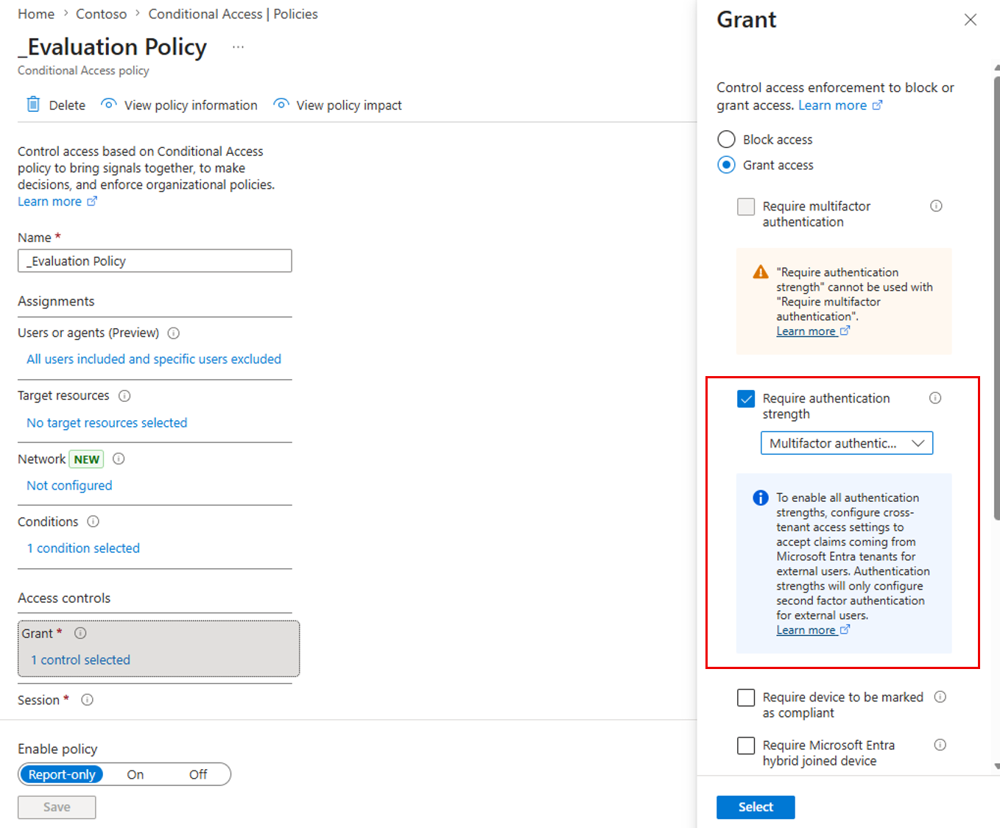

세 가지 기본 제공 인증 강도(다중 인증 강도, 패스워드리스 MFA 강도, 피싱 대응 MFA 강도) 중에서 선택할 수 있으며, 허용하려는 인증 방법 조합을 기반으로 사용자 지정 인증 강도를 만들 수도 있습니다.

***Ref: [**built-in authentication strengths**](https://learn.microsoft.com/en-us/entra/identity/authentication/concept-authentication-strengths#built-in-authentication-strengths)***

> [!NOTE]
>
> - **MFA strength**: ‘다중 인증 요구(Require multifactor authentication)’ 설정을 충족하는 데 사용할 수 있는 동일한 인증 조합을 포함합니다.
> - **Passwordless MFA strength**: 패스워드리스 MFA 강도: MFA 요건을 충족하지만 비밀번호를 요구하지 않는 인증 방법을 포함합니다.
> - **Phishing-resistant MFA strength**: 피싱 대응 MFA 강도: 인증 방법과 로그인 화면 간의 상호작용을 필요로 하는 인증 방식을 포함합니다.

| Authentication method combination | MFA strength | Passwordless MFA strength | Phishing-resistant MFA strength |
| --- | --- | --- | --- |
| FIDO2 security key | ✅ | ✅ | ✅ |
| Windows Hello for Business or platform credential | ✅ | ✅ | ✅ |
| Certificate-based authentication (multifactor) | ✅ | ✅ | ✅ |
| Microsoft Authenticator (phone sign-in) | ✅ | ✅ |  |
| Temporary Access Pass (one-time use and multiple use) | ✅ |  |  |
| Password plus something the user has<sup>1</sup> | ✅ |  |  |
| Federated single-factor plus something the user has<sup>1</sup> | ✅ |  |  |
| Federated multifactor | ✅ |  |  |
| Certificate-based authentication (single-factor) |  |  |  |
| SMS sign-in |  |  |  |
| Password |  |  |  |
| Federated single-factor |  |  |  |

<sup>1</sup> 사용자가 소유한 요소(Something the user has)는 다음 인증 방법 중 하나를 의미합니다: 문자 메시지, 음성 통화, 푸시 알림, 소프트웨어 OATH 토큰, 또는 하드웨어 OATH 토큰.


***Ref: [**create a custom authentication strength**](https://learn.microsoft.com/en-us/entra/identity/authentication/concept-authentication-strengths#custom-authentication-strengths)***

---

## Authentication context

Authentication Context는 애플리케이션 내의 데이터와 작업을 더욱 안전하게 보호하는 데 사용할 수 있습니다. 사용자가 민감한 데이터나 작업에 접근할 때 특정 정책을 트리거하도록 구성할 수 있습니다.

Authentication Context는 **Protection > Conditional Access > Authentication context**에서 관리되며, 조직은 **총 99개의 Authentication Context(C1–C99)**만 생성할 수 있다는 점에 유의해야 합니다. 가능한 한 여러 리소스에서 공통으로 사용할 수 있는 이름(예: **"C1 - 신뢰할 수 있는 디바이스 요구"**)을 사용하여 필요한 Authentication Context 수를 줄이는 것을 권장합니다.

관리자는 Conditional Access 정책의 **Assignments > Cloud apps or actions**에서 게시된 Authentication Context를 선택하고, *Select what this policy applies to* 메뉴에서 **Authentication context**를 선택할 수 있습니다.

현재 **“매번 로그인 빈도 요구(sign-in frequency every time)”** 세션 제어는 **Authentication Context와 함께 사용할 수 없다는 점**도 참고해야 합니다.

### Authentication context scenarios

Authentication Context를 적용할 수 있는 일반적인 시나리오를 설명하시오.


#### Privileged Identity Management

권한 있는 역할을 받을 자격이 있는 사용자에게 Conditional Access 정책 요구 사항을 충족하도록 설정할 수 있습니다. 예를 들어, Authentication Strengths로 강제되는 특정 인증 방법을 사용하도록 요구하거나, Intune 규정 준수 디바이스에서만 역할을 상승시키도록 하거나, 이용 약관 준수를 요구할 수 있습니다.

##### **Consider demoing a PIM role activation**

1. 사용자 지정 인증 강도를 생성하시오. 단, SMS는 포함하지 마십시오.

    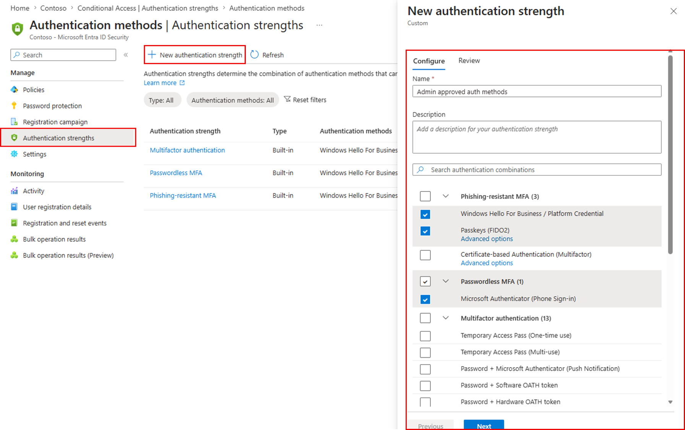

    ***Ref: [Create and manage custom Conditional Access authentication strengths](https://learn.microsoft.com/en-us/entra/identity/authentication/concept-authentication-strength-advanced-options)***

1. Conditional Access 정책과 연결될 Authentication Context를 생성하시오.

    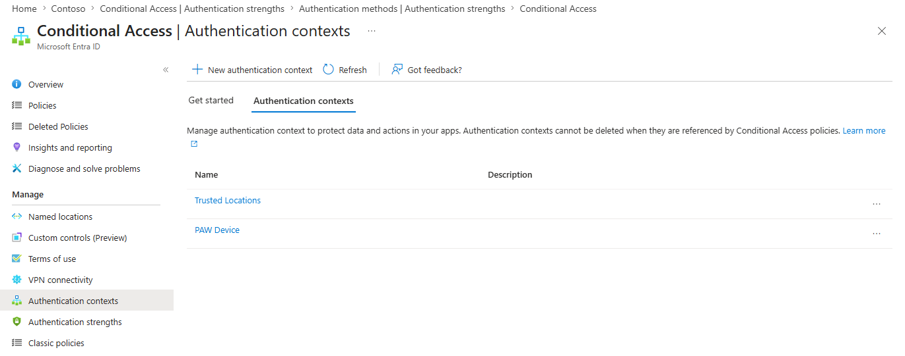

    ***Ref: [Configure authentication contexts](https://learn.microsoft.com/en-us/entra/identity/conditional-access/concept-conditional-access-cloud-apps?tabs=powershell#configure-authentication-contexts)***

1. PIM에서 역할 설정을 수정하여 역할 활성화 시 Authentication Context가 필요하도록 구성하시오.

    ***Ref: [On activation, require Microsoft Entra Conditional Access authentication context](https://learn.microsoft.com/en-us/entra/id-governance/privileged-identity-management/pim-how-to-change-default-settings#on-activation-require-microsoft-entra-conditional-access-authentication-context)***

    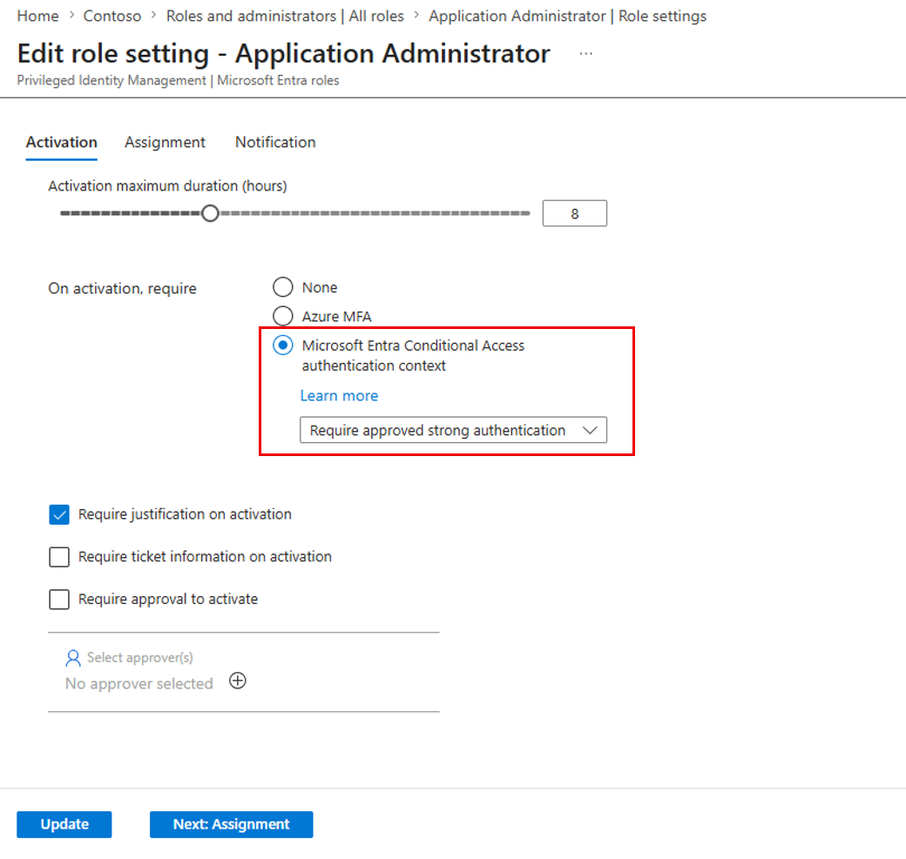

1. Conditional Access 정책에서 Authentication Context를 추가하고, Grant 섹션에서 이전에 생성한 인증 강도를 선택하십시오.

    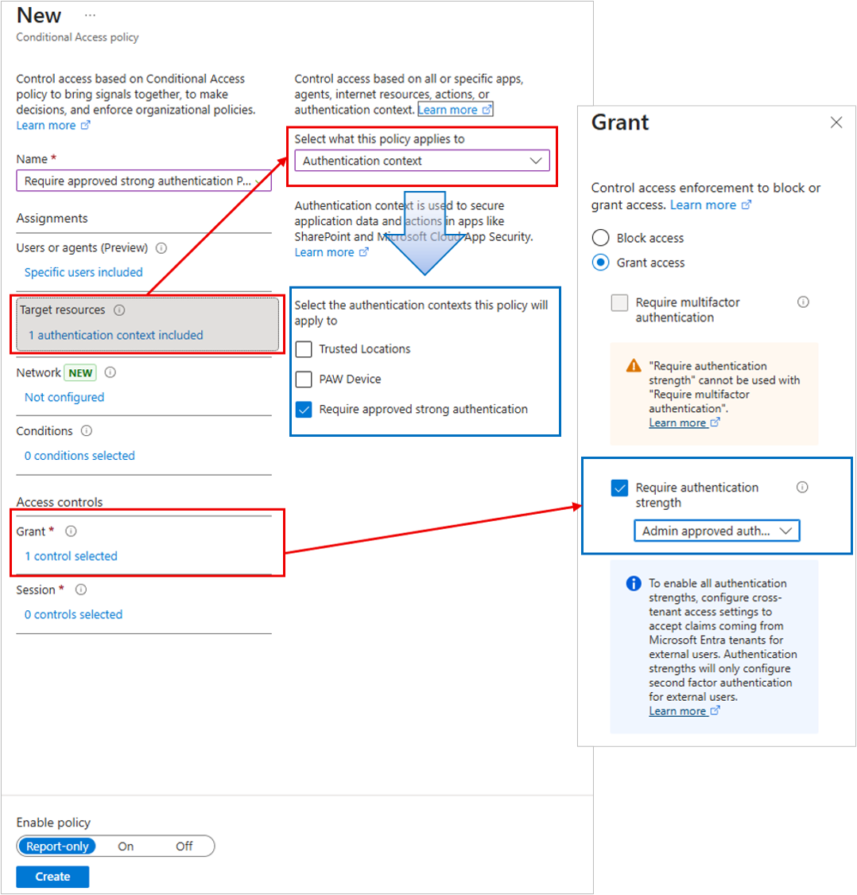

1. 해당 역할에 대한 자격이 있는 사용자로 로그인하십시오. MFA가 필요한 경우, 이전에 생성한 인증 강도에 포함되지 않은 인증 방법(예: SMS)을 사용할 수 있습니다.

    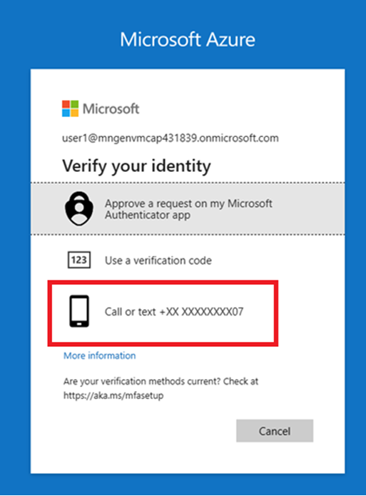

    *or*   

    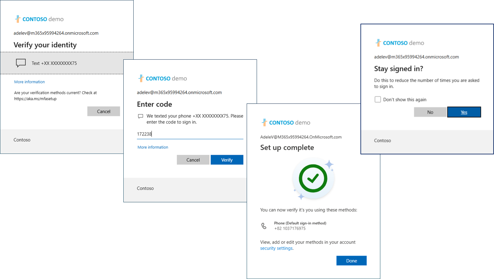

    ***Ref: MFA - SMS인증으로 로그인하는 과정***

1. PIM을 사용하여 역할을 활성화하십시오. 이때 Conditional Access 정책을 충족해야 합니다. 이 예시에서는 SMS가 인증 강도에 포함되지 않았기 때문에 Microsoft Authenticator를 사용해 MFA를 완료해야 합니다.

    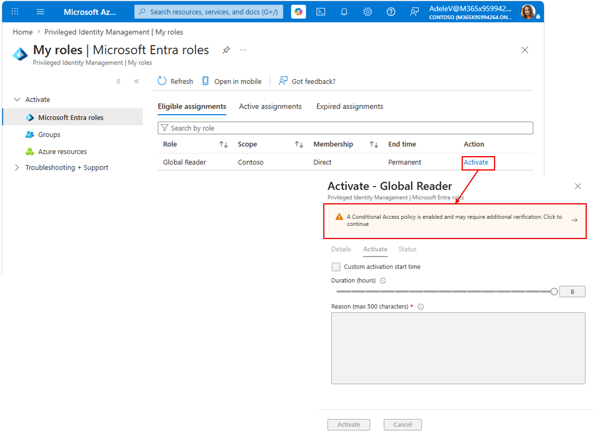

    *or*

    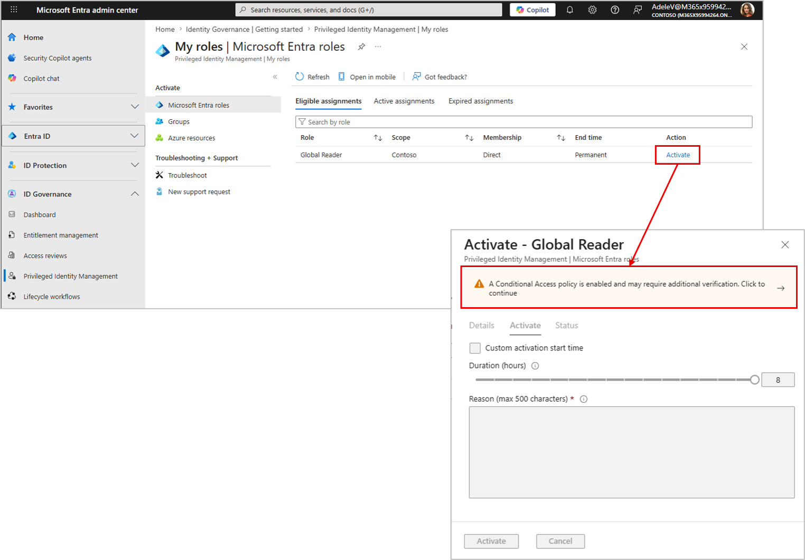

    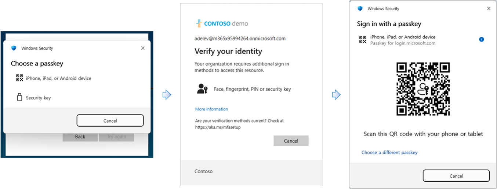

    실패한 구성의 경우:

    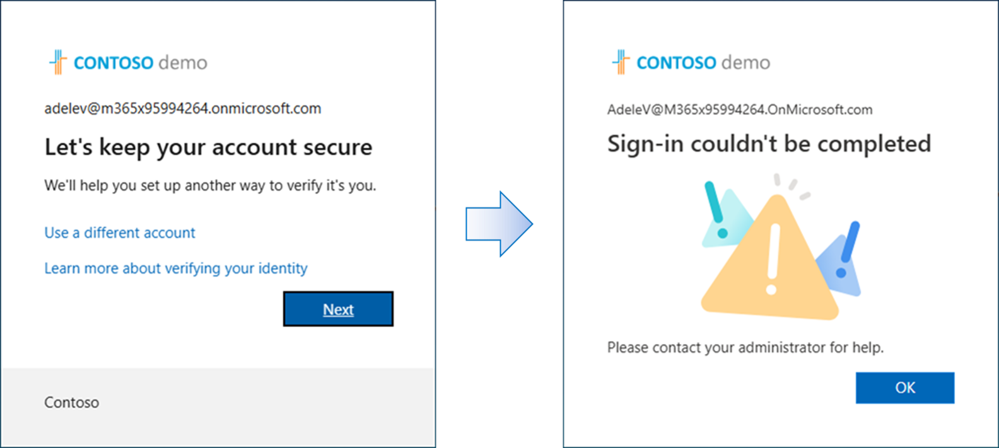

**활성화 시 Microsoft Entra Conditional Access Authentication Context 요구** 설정은 사용자가 역할을 활성화할 때 충족해야 하는 Authentication Context 요구 사항을 정의합니다. 역할이 활성화된 이후에는 사용자가 다른 브라우저 세션, 디바이스, 또는 위치에서 권한을 사용하는 것이 제한되지 않습니다.

예를 들어, 사용자가 Intune 규정 준수 디바이스를 사용해 역할을 활성화할 수 있습니다. 그런 다음 역할이 활성화된 후에는 Intune 규정 비준수 디바이스에서 동일한 사용자 계정으로 로그인하여 이미 활성화된 역할을 사용할 수도 있습니다.

이러한 상황을 방지하려면 다음과 같이 두 개의 Conditional Access 정책을 만들 수 있습니다:

- **첫 번째 Conditional Access 정책**은 Authentication Context를 대상으로 합니다. 모든 사용자 또는 해당 역할의 자격이 있는 사용자를 범위에 포함해야 합니다. 이 정책은 사용자가 역할을 활성화할 때 충족해야 하는 요구 사항을 정의합니다.
- **두 번째 Conditional Access 정책**은 디렉터리 역할을 대상으로 합니다. 이 정책은 사용자가 활성화된 디렉터리 역할로 로그인할 때 충족해야 하는 요구 사항을 정의합니다.

#### SharePoint and OneDrive

Authentication Context를 사용하여 Microsoft Entra Conditional Access 정책을 SharePoint 사이트에 연결할 수 있습니다. 정책은 사이트에 직접 적용하거나 민감도 레이블을 통해 적용할 수 있습니다.

> [!IMPORTANT]
>
> 이 기능은 SharePoint의 루트 사이트(예: https://contoso.sharepoint.com)에는 적용할 수 없습니다.

##### 요구 사항과 제한 사항

요구 사항([requirements](https://learn.microsoft.com/en-us/sharepoint/authentication-context-example#what-do-you-need-to-set-up-conditional-access-policies)) 및 제한 사항([limitations](https://learn.microsoft.com/en-us/sharepoint/authentication-context-example#limitations))에 대하여 설명합니다.

- 기본적으로 필요한 라이선스(둘 중 하나 이상)

    - **Office 365 E3 / E5 / A5**
    - **Microsoft 365 E1 / E3 / E5 / A5**

- 추가로 필요한 라이선스(둘 중 하나 이상)

    - **Microsoft 365 Copilot 라이선스** → 조직 내 최소 1명에게 Copilot 라이선스가 있으면 SharePoint 관리자에게 필요한 고급 관리 기능이 자동 활성화됨.
    - **Microsoft SharePoint Advanced Management(고급 관리) 라이선스** → 별도 구매 가능.

- 추가 고려 라이선스(특정 기능 사용 시 필요)

    - Microsoft 365 E5/A5/G5
    - Microsoft 365 E5/A5 Compliance
    - Microsoft 365 E5 Information Protection & Governance
    - Office 365 E5/A5/G5

- 관리자 권한 요구 사항

    SharePoint 관리자 또는 동등한 권한이 있어야 함.

- **제한 사항**

    Authentication Context를 적용하면 일부 앱/기능이 동작하지 않음:
    
    - 구버전 Office 앱
    - SharePoint 모바일 앱
    - Viva Engage
    - Teams의 일부 기능(채널 OneNote 추가, 녹화 업로드 등)
    - OneDrive 동기화
    - Power BI의 “SharePoint 리스트 시각화”
    - Outlook 앱(Win/Mac/iOS/Android)에서 인증 컨텍스트 적용 사이트 접근 불가
    - 다중 파일 다운로드, 지역 간 파일 이동 등 일부 기능 제한

##### Consider demoing or testing in your environment

테스트 또는 데모를 위해 환경에서 직접 구성해볼 수 있습니다.
민감도 레이블(Sensitivity Label)을 생성하거나 수정한 뒤, Conditional Access Authentication Context를 적용하고 접근을 테스트하십시오. 이 예시에서는 Authentication Strength를 요구합니다(자세한 내용은 위의 “Authentication Strength” 섹션 참고).
고도의 민감한 콘텐츠가 포함된 SharePoint 사이트에 접근하려면 관리자 승인 인증 방법을 사용하여 인증해야 합니다.

###### Enable sensitivity labels for SharePoint and OneDrive

1. 전역 관리자로 Microsoft Purview 규정 준수 포털에 로그인한 후, 다음 경로로 이동합니다:

    Solutions > Information protection > Labels

1. Office 온라인 파일에서 콘텐츠를 처리하는 기능을 활성화하라는 메시지가 표시되면, **Turn on now(지금 켜기)**를 선택합니다:

    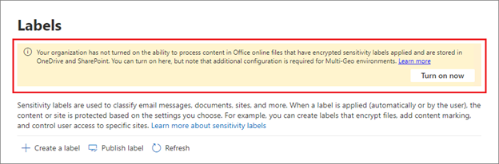

1. 아직 컨테이너에 대한 민감도 레이블을 활성화하지 않았다면, 다음 단계를 1회성 작업으로 수행합니다:

    1. 민감도 레이블 지원 활성화: Microsoft Entra ID에서 Microsoft 365 그룹에 민감도 레이블을 할당합니다.

        ```powershell
        
        Install-Module Microsoft.Graph -Scope AllUsers        
        Install-Module Microsoft.Graph.Beta -Scope AllUsers

        Import-Module Microsoft.Graph
        Import-Module Microsoft.Graph.Beta
        
        Connect-MgGraph -Scopes "Directory.ReadWrite.All"
        
        Get-MgContext
        
        Select-MgProfile -Name "Beta"
        
        ```
        
        **Check current settings**
        
        ```powershell
        
        Get-MgBetaDirectorySettingTemplate | Format-Table DisplayName, Id, Values
        
        $grpUnifiedSetting = (Get-MgBetaDirectorySetting | where -Property DisplayName -Value "Group.Unified" -EQ)
        
        $Setting = $grpUnifiedSetting
        
        $grpUnifiedSetting.Values | Format-Table Name, Type, DefaultValue, Description
        
        ```
        
        **그룹 설정이 비어 있으면 새로 생성하고 그룹 설정의 "EnableMIPLabels"를 설정합니다**
        
        ***Ref: [create new group settings](https://learn.microsoft.com/en-us/entra/identity/users/groups-settings-cmdlets)***


        ```powershell
                
        # Create new DirectorySetting

        $TemplateId = (Get-MgBetaDirectorySettingTemplate | where { $_.DisplayName -eq "Group.Unified" }).Id
        $Template = Get-MgBetaDirectorySettingTemplate | where -Property Id -Value $TemplateId -EQ
        
        $params = @{
           templateId = "$TemplateId"
           values = @(
              @{
                 name = "EnableMIPLabels"
                 value = "True"
              }
           )
        }

        New-MgBetaDirectorySetting -BodyParameter $params
        
        $Setting = Get-MgBetaDirectorySetting | where { $_.DisplayName -eq "Group.Unified"}
        $Setting.Values
      
        ```

        **다시 확인해 보세요. 이제 그룹 설정을 사용할 수 있어야 합니다.**

        ```powershell

        $Setting = Get-MgBetaDirectorySetting | where { $_.DisplayName -eq "Group.Unified"}        
        $Setting.Values

        ```

        *Ref: Update settings at the directory level*

        ```powershell

        $Setting = Get-MgBetaDirectorySetting | where { $_.DisplayName -eq "Group.Unified"}
        $Setting.Values
        
        $params = @{
           Values = @(
              @{
                 Name = "UsageGuidelinesUrl"
                 Value = ""
              }
           )
        }
        
        Update-MgBetaDirectorySetting -DirectorySettingId $Setting.Id -BodyParameter $params
        
        ```
        


    1. 이제 민감도 레이블을 Microsoft Entra ID와 동기화해야 합니다. 먼저 Security & Compliance PowerShell에 연결하세요.

        ***Ref: [Connect to Security & Compliance PowerShell](https://learn.microsoft.com/en-us/powershell/exchange/connect-to-scc-powershell?view=exchange-ps)***

        ```powershell
        
        Import-Module ExchangeOnlineManagement
        
        # IT must be version 3.x
        
        Get-InstalledModule ExchangeOnlineManagement | Format-List Name,Version
        
        Connect-IPPSSession -UserPrincipalName "UserPrincipalName of a Global Admin"
        
        ```
        
    1. 그런 다음 다음 명령을 실행하여 민감도 레이블을 Microsoft 365 그룹에서 사용할 수 있도록 설정하세요.
        
        ```powershell
        
        Execute-AzureAdLabelSync
        
        ```

###### Create or edit a sensitivity label

1. Create sensitivity label - Groups & Sites

    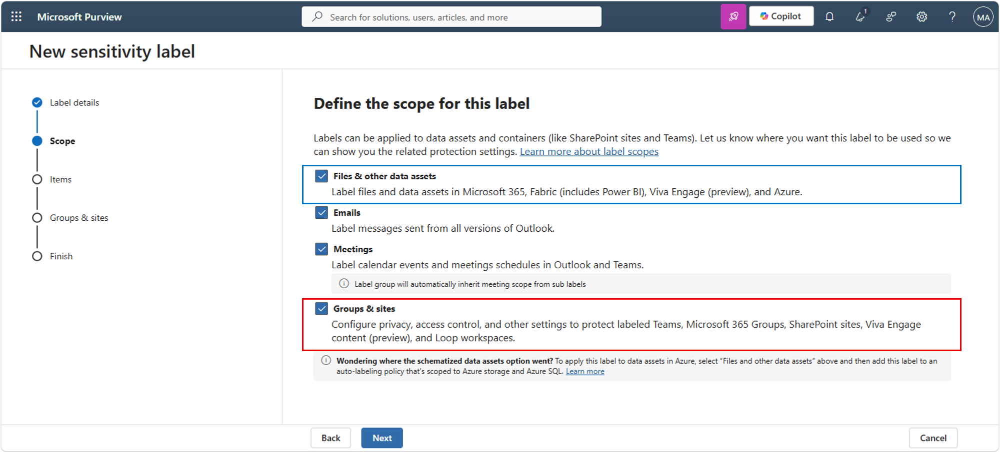

1. **"External sharing and Conditional Access"**을 선택하세요.

    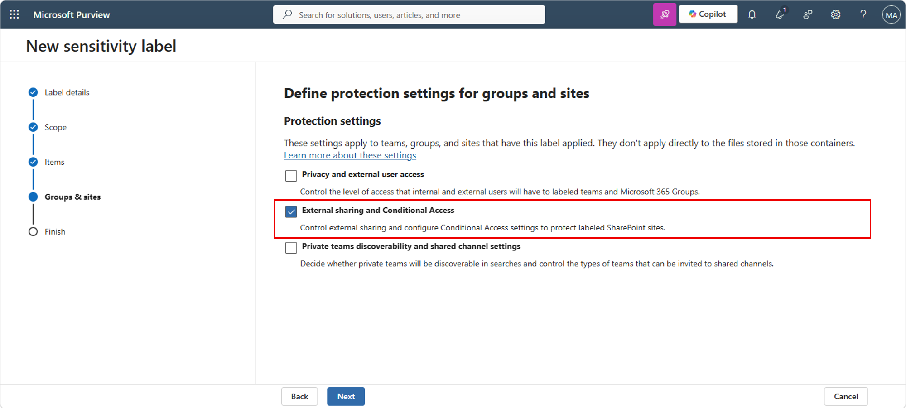

1. **"Use Entra Conditional Access to protect labeled SharePoint sites"**을 선택한 다음 적용하려는 인증 컨텍스트(Authentication Context)를 선택하세요.

    > [!NOTE]
    >
    > **Authentication Context**는 생성되어 있어야 합니다.
    
    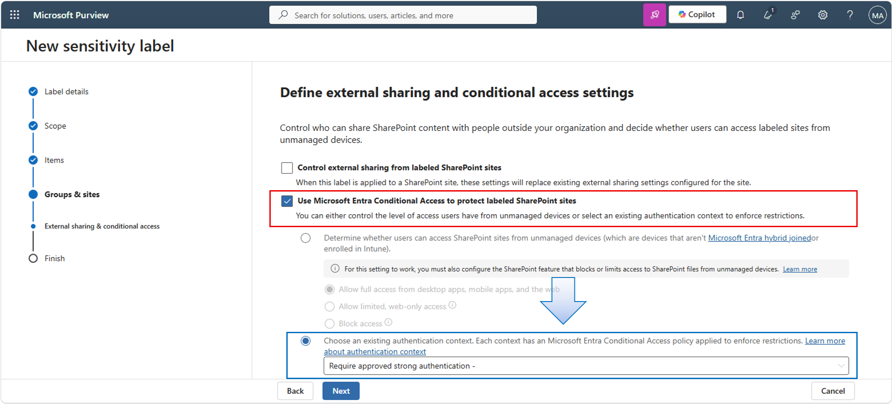
    
    절차를 완료한 후 민감도 레이블을 게시(publish)하세요.

    *Ref: [Publish sensitivity labels by creating a label policy](https://learn.microsoft.com/en-us/purview/create-sensitivity-labels?tabs=classic-label-scheme#publish-sensitivity-labels-by-creating-a-label-policy)

    > [!NOTE]
    >
    > For modern label scheme
    >
    > *Ref: [Migrate parent sensitivity labels to label groups](https://learn.microsoft.com/en-us/purview/migrate-sensitivity-label-scheme)

1. 새로운 SharePoint 사이트를 만들거나 기존 사이트를 수정한 뒤, 민감도 레이블을 적용하세요:

    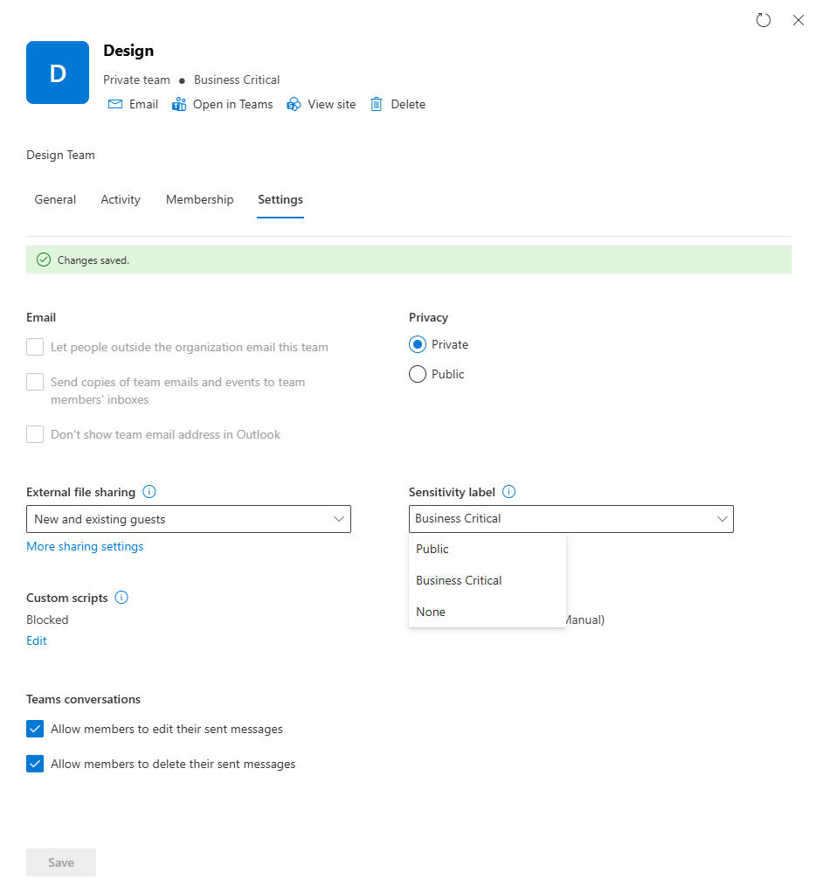


**Label 구성 및 SPO 팀 사이트에 label 할당:**

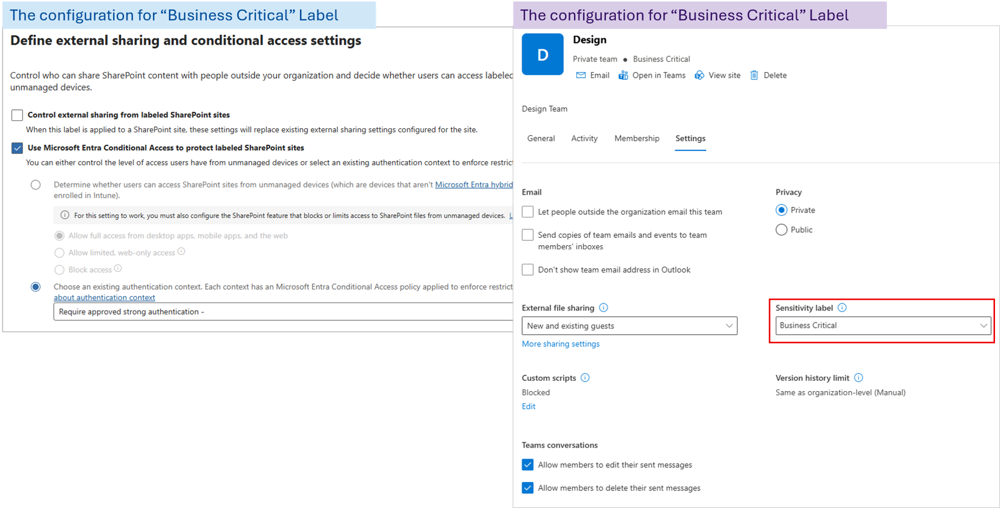

**Conditional Access 정책 구성:**

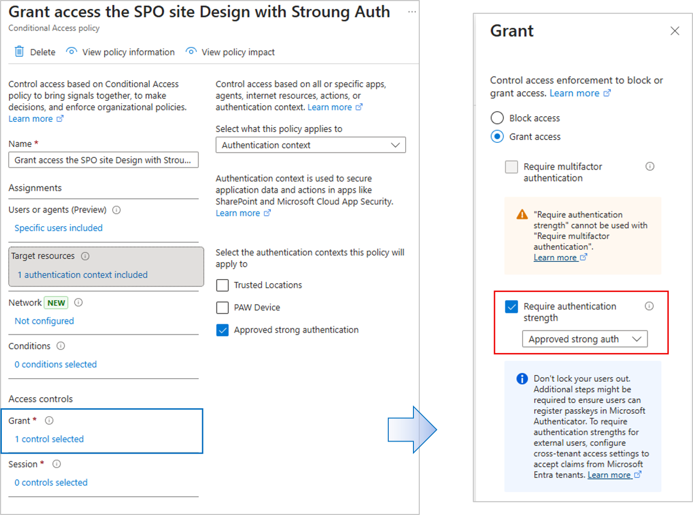


###### Test access

SharePoint 사이트 "Business Critical"에 연결된 CA 정책은 SMS 및 음성 통화를 유효한 MFA 방식으로 인정하지 않는 인증 강도를 요구하고 있습니다.

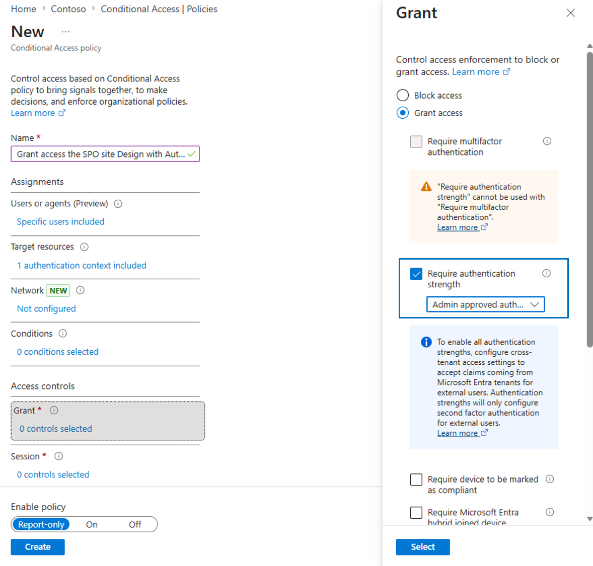

SMS 또는 음성 통화를 사용하여 인증하세요

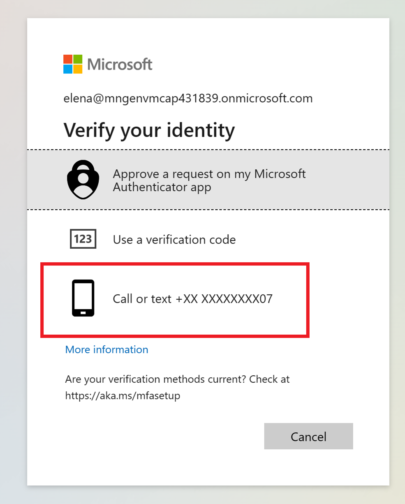

SharePoint 사이트 "Design"(또는 이 테스트를 위해 생성하고 민감도 레이블을 적용한 다른 사이트)에 접근을 테스트해보세요.

자동으로 로그인할 수 없을 것입니다.

인증 강도에 포함된 허용된 인증 방법 중 하나를 구성해두었다면, 해당 방법을 사용하여 인증하라는 요청을 받게 됩니다.

이 예시에서는 인증 강도에 Authenticator 앱이 포함되어 있고, 사용자가 Authenticator 앱을 이미 설정해둔 상태입니다.

따라서 사용자는 승인된 MFA 방식인 Authenticator 앱을 통해 인증 요청을 받게 됩니다.

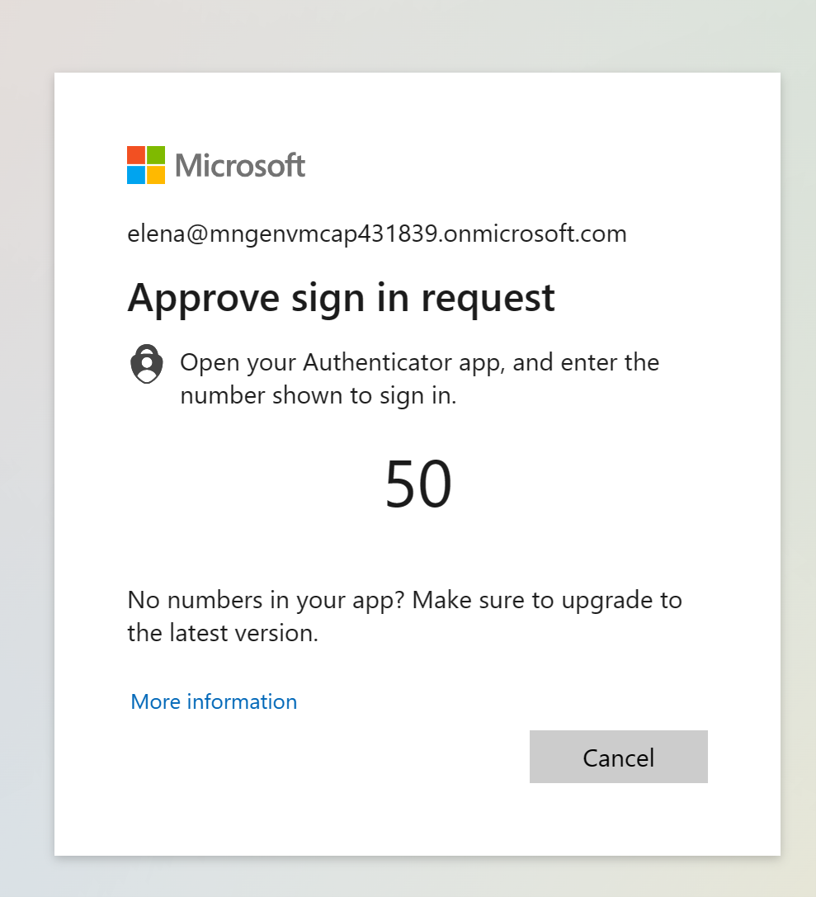

올바른 MFA 방식으로 인증을 완료하면 정상적으로 로그인됩니다.

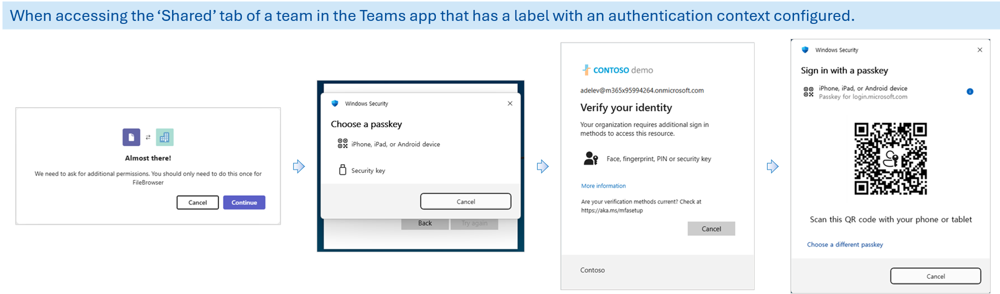

잘못 구성된 테스트:

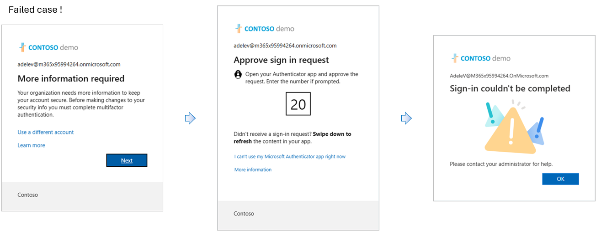

#### Custom application integrated in Entra ID

인증에 OpenID Connect / OAuth 2.0을 사용하는 모든 앱은, 조직에서 개발한 앱을 포함하여, 인증 컨텍스트 값을 사용할 수 있습니다.

이를 통해 고가치 트랜잭션이나 직원 개인정보 조회와 같은 민감한 리소스를 더욱 안전하게 보호할 수 있습니다.

Reference: [Developer guidance for Microsoft Entra Conditional Access authentication context](https://learn.microsoft.com/en-us/entra/identity-platform/developer-guide-conditional-access-authentication-context)

Code sample: [Use the Conditional Access auth context to perform step-up authentication](https://github.com/Azure-Samples/ms-identity-ca-auth-context/blob/main/README.md)

---

## External Multifactor Authentication

외부 다단계 인증(MFA)은 이전에 외부 인증 방법으로 불렸으며, 사용자가 업무용 또는 학교 계정으로 로그인할 때 MFA 요구 사항을 충족하기 위해 외부 제공자를 선택할 수 있도록 합니다.
Microsoft Entra ID는 계속해서 정책 평가와 액세스 결정을 담당하는 ID 제어 plane 역할을 수행합니다.

외부 MFA는 조건부 액세스 정책, Microsoft Entra ID Protection 기반 위험 조건부 액세스 정책, Privileged Identity Management(PIM) 활성화, 그리고 애플리케이션 자체가 MFA를 요구하는 경우에도 MFA 요구 사항을 충족합니다.

또한 외부 MFA를 사용하려면 최소 Microsoft Entra ID P1 라이선스가 필요합니다.

외부 MFA는 페더레이션과 다릅니다.

외부 MFA에서는 사용자 ID가 Microsoft Entra ID에서 생성되고 관리되지만,

페더레이션에서는 사용자 ID가 외부 ID 공급자에서 관리됩니다.

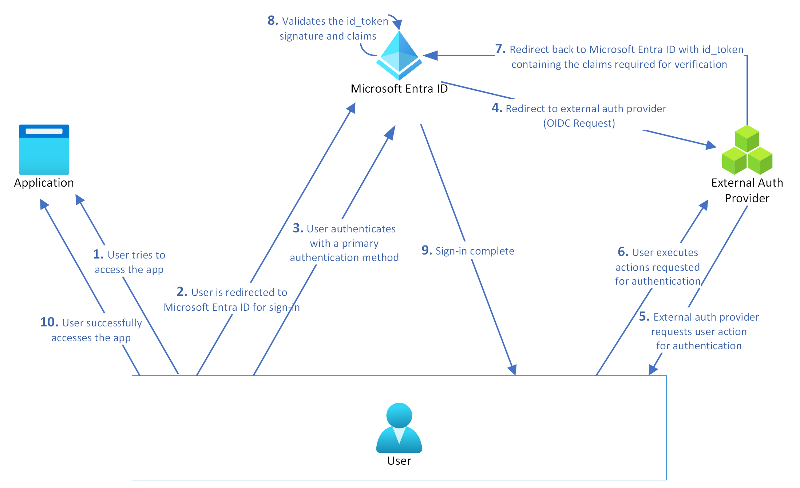

[steps to Create an External MFA](https://learn.microsoft.com/en-us/entra/identity/authentication/how-to-authentication-external-method-manage#create-an-eam-in-the-admin-center)에 대하여 설명합니다.


---

## Identity Protection

Entra ID Identity Protection은 조직을 ID 기반 위협으로부터 보호하는 데 도움을 주는 서비스입니다. 이 서비스는 머신 러닝과 휴리스틱을 사용하여 이상 징후와 위험한 로그인 행동을 감지하고, 잠재적인 침해나 계정 탈취 가능성을 관리자에게 알립니다. 또한 Conditional Access와 같은 도구에 신호를 전달하여 접근 제어 결정을 내리거나, 보안 정보 및 이벤트 관리(SIEM) 도구로 신호를 보내 추가 조사 및 상관 분석을 수행하는 등 위험을 완화하고 ID를 보호하기 위한 조치를 취할 수 있도록 지원합니다.

모든 Entra ID Identity Protection 기능을 사용하려면 Microsoft Entra ID P2 라이선스가 필요하지만, 일부 제한된 기능은 Entra ID Free 및 Entra ID P1 라이선스에서도 사용할 수 있습니다. 자세한 내용은 Entra ID Protection 라이선스 요구 사항을 참고하세요.

***Ref: [Entra ID Identity Protection - License requirements](https://learn.microsoft.com/en-us/entra/id-protection/overview-identity-protection#license-requirements)***

또한 Identity Protection을 사용하려면 사용자에게 Security Reader, Security Operator, Security Administrator, Global Reader 또는 Global Administrator 역할이 필요합니다. 자세한 내용은 Identity Protection 사용을 위한 필수 역할을 확인하세요.

***Ref: [Entra ID Identity Protection - Required roles](https://learn.microsoft.com/en-us/entra/id-protection/overview-identity-protection#required-roles)***

### Risk based policies

Microsoft Entra ID P2 라이선스를 보유한 조직은 Microsoft Entra ID Protection의 로그인 위험 감지 기능을 포함한 조건부 액세스 정책을 생성할 수 있습니다.

***Ref: [Microsoft Entra ID Protection sign-in risk detections](https://learn.microsoft.com/en-us/entra/id-protection/concept-identity-protection-risks)***

또한 Microsoft Entra ID Protection에서 구성되었던 기존(레거시) 위험 정책은 2026년 10월 1일에 사용 중단될 예정입니다. 고객이 아직 레거시 ID Protection 정책을 사용 중이라면 조건부 액세스 정책으로 전환하도록 안내해야 합니다. 자세한 내용은 ‘Migrate ID Protection risk policies to Conditional Access’를 참고하세요.

***Ref: [Migrate ID Protection risk policies to Conditional Access](https://learn.microsoft.com/en-us/entra/id-protection/concept-identity-protection-policies#migrate-id-protection-risk-policies-to-conditional-access)***

위험(Risk)은 사용자([User](https://learn.microsoft.com/en-us/entra/id-protection/concept-identity-protection-risks#user-risk-detections)) 수준과 로그인([Sign-in](https://learn.microsoft.com/en-us/entra/id-protection/concept-identity-protection-risks#sign-in-risk-detections)) 수준에서 모두 감지될 수 있습니다.

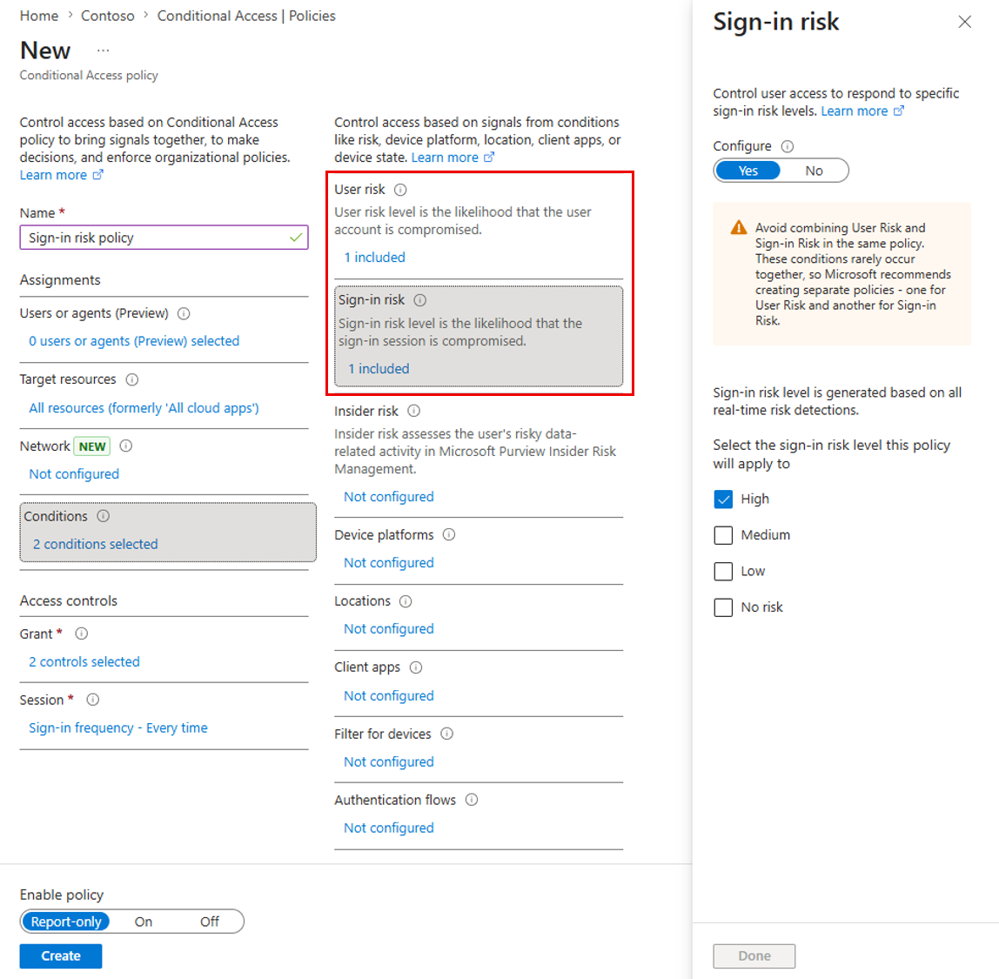

> [!WARNING]
>
>동일한 조건부 액세스 정책에서 Sign-in Risk와 User Risk를 함께 사용하지 마세요. 조건부 액세스 엔진은 조건들 사이를 AND 논리로 평가하기 때문에, 예를 들어 Sign-in Risk와 User Risk가 모두 높을 때 조치를 요구하도록 설정했지만 실제로는 둘 중 하나만 높은 경우 정책이 트리거되지 않습니다. 따라서 Sign-in Risk용 정책과 User Risk용 정책을 각각 별도로 구성해야 합니다.

#### Microsoft recommendation

[Microsoft recommendation](https://learn.microsoft.com/en-us/entra/id-protection/howto-identity-protection-configure-risk-policies#microsoft-recommendations)에 대하여 설명합니다.

1. **User risk policy(사용자 위험 정책)**

    - ✔ Microsoft 권장 설정

        **사용자 위험 수준이 High일 때 → Require risk remediation(위험 완화 요구)**

        즉, 계정이 이미 탈취되었을 가능성이 매우 높을 때는사용자가 스스로 보안 절차를 수행하여 계정을 복구하도록 요구하는 방식입니다.

    - ✔ 사용자 유형별 동작

        - **패스워드리스 사용자** → Microsoft Entra가 해당 사용자의 모든 세션을 취소하고, 다시 인증하도록 요구함
        - **비밀번호 기반 사용자** → MFA 인증에 성공한 후 **보안 비밀번호 변경(secure password change)** 을 완료해야 함

    - ✔ Require risk remediation을 선택하면 자동 적용되는 설정

        1. **Require authentication strength**(인증 강도 요구) — 자동으로 Grant control에 선택됨
        2. **Sign-in frequency = Every time** — 매 로그인마다 재인증하도록 Session control 자동 적용

1. **Sign-in risk policy(로그인 위험 정책)**

    - ✔ Microsoft 권장 설정
    
        **로그인 위험 수준이 Medium 또는 High일 때 → MFA 요구**
        
        즉, 로그인 시도가 수상할 때는사용자가 본인임을 증명하도록 MFA를 요구하는 방식입니다.
    
    - ✔ 왜 MFA인가?
    
        - 사용자가 등록한 인증 방법 중 하나로 본인임을 증명할 수 있음
        - 이를 통해 **로그인 위험을 스스로 해소(self-remediate)** 할 수 있음
    
    - ✔ 추가 권장 설정
    
        - **Sign-in frequency = Every time** → 위험한 로그인은 매번 재인증하도록 설정하는 것이 권장됨
    
    - ✔ 중요한 점
    
        - 로그인 위험은 **강력한 인증(strong authentication)** 을 통해서만 해소됨
    
            - MFA 또는 패스워드리스 인증
            - 위험 수준과 관계없이 동일하게 적용됨

#### User risk policy

사용자 위험(User Risk)을 기반으로 액세스 제어를 적용할 수 있는 주요 옵션은 다음 세 가지입니다.

- **위험 완화 요구(미리 보기):** ID Protection이 모든 인증 방법에 대해 적절한 위험 완화 절차를 자동으로 처리합니다.

- **비밀번호 변경 요구:** 사용자가 안전한 비밀번호 변경을 완료할 때까지 ID Protection이 액세스를 차단합니다.

- **액세스 차단:** 위험이 해결될 때까지 ID Protection이 사용자의 액세스를 차단합니다.

**[Require Risk Remediation](https://learn.microsoft.com/en-us/entra/id-protection/concept-identity-protection-policies#require-risk-remediation-with-microsoft-managed-remediation-preview)**(위험 완화 요구)를 사용할 때의 장점과 현재 제한 사항 및 특별 고려 사항은 다음과 같습니다.

- Require authentication strength와 Sign-in frequency(매번 요구)는 다음 두 가지 이유로 정책에 자동 적용됩니다.

    - 세션이 취소된 후 사용자가 다시 인증하도록 안내해야 합니다.
    
    - 인증 강도를 요구하면 비밀번호 기반 사용자와 패스워드리스 사용자 모두가 정책의 적용 대상이 되도록 보장할 수 있습니다.

- Microsoft Entra ID는 외부 사용자와 게스트 사용자에 대한 세션 취소(Session Revocation)를 지원하지 않기 때문에, 이 사용자들은 보안 비밀번호 재설정(Secure Password Reset)을 통해 계속해서 스스로 위험을 완화해야 합니다.

> [!TIP]
> **Require Remediation: How It Works**
>
> 조건부 액세스(Conditional Access)에서 관리자는 비밀번호 기반과 패스워드리스 방식을 포함한 모든 인증 방법을 지원하는 사용자 위험(User Risk) 정책을 구성할 수 있습니다. 이는 정책의 Grant Controls에서 **“Require risk remediation(위험 완화 요구)”**를 선택하면, Microsoft Entra ID Protection이 감지된 위협과 사용자의 인증 방식에 따라 적절한 위험 완화 절차를 자동으로 처리한다는 의미입니다. 그 동작 논리는 다음과 같습니다.
>
> Path 1 – 비밀번호 기반 인증:  
> 사용자가 유출된 자격 증명, 패스워드 스프레이 공격, 또는 손상된 비밀번호가 사용된 세션 기록과 같은 활성 위험 감지 항목을 가진 위험 사용자일 경우, 사용자에게 보안 비밀번호 변경을 수행하라는 요청이 표시됩니다. 사용자가 비밀번호 변경을 완료하면, 이전 세션은 모두 취소됩니다.
>
> Path 2 – 패스워드리스 인증:  
> 사용자가 위험 사용자로 분류되어 활성 위험 감지 항목이 있지만, 그 위험이 손상된 비밀번호와 관련되지 않은 경우입니다. 가능한 위험 감지에는 비정상적인 토큰, 불가능한 이동(불가능한 위치 이동), 익숙하지 않은 로그인 속성 등이 포함됩니다. 이 경우 사용자의 세션이 취소되며, 사용자는 다시 로그인하라는 요청을 받게 됩니다.

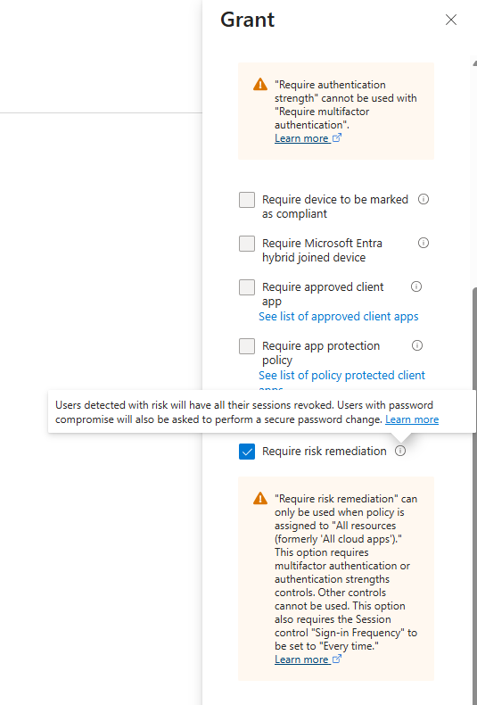

*Ref: [Require Risk Remediation](https://learn.microsoft.com/en-us/entra/identity/conditional-access/concept-conditional-access-grant#require-risk-remediation)

#### Sign-in risk policy

Sign-in Risk 수준이 Medium 또는 High일 때는 Microsoft Entra 다단계 인증(MFA)을 요구하거나, 가능한 사용자에게는 Passwordless MFA 또는 피싱 저항 MFA를 요구하는 것이 좋습니다.

위험 수준이 낮은(Low) 상태에서 액세스 제어를 요구하면 사용자 중단(User Interrupt)이 증가하게 됩니다. 또한, 보안 비밀번호 변경(Secure Password Change)이나 MFA 인증과 같은 자가 위험 완화(Self-remediation) 옵션을 허용하지 않고 액세스를 차단(Block access)하도록 설정하면 사용자와 관리자 모두에게 더 큰 영향을 줄 수 있습니다.
따라서 정책을 구성할 때 이러한 선택이 가져올 영향을 신중하게 고려해야 합니다.

> [!NOTE]
>
> Sign-in Risk 기반 정책은 사용자가 위험한 세션에서 MFA를 등록하지 못하도록 보호합니다.
>
> 사용자가 MFA에 등록되어 있지 않은 상태에서 위험한 로그인이 발생하면 해당 로그인은 차단되며, 사용자는 AADSTS53004 오류를 보게 됩니다.

Risk-based 정책을 사용할 때의 또 다른 장점은, 사용자가 로그인 위험(Sign-in Risk)과 사용자 위험(User Risk)을 스스로 완화(Self-remediate)할 수 있다는 점입니다.

***Ref: [self-remediate their sign-in risks and user risks](https://learn.microsoft.com/en-us/entra/id-protection/howto-identity-protection-remediate-unblock#self-remediation-with-risk-based-policy)***

이를 위해 사용자는 반드시 **Self-Service Password Reset(SSPR)**에 등록되어 있어야 합니다.

Password Hash Synchronization(PHS)을 활성화한 조직은 이제 온프레미스에서 비밀번호 변경을 수행하여 사용자 위험(User Risk)을 완화할 수 있습니다.

***Ref: [password hash synchronization](https://learn.microsoft.com/en-us/entra/identity/hybrid/connect/whatis-phs)***

***Ref: [allow password changes on-premises to remediate user risk.](https://learn.microsoft.com/en-us/entra/id-protection/howto-identity-protection-remediate-unblock#allow-on-premises-password-reset-to-remediate-user-risks-preview)***

### Microsoft Entra multifactor authentication registration policy

Microsoft Entra ID Protection은 조직이 Microsoft Entra MFA 등록을 단계적으로 도입할 수 있도록 지원합니다.

사용자가 어떤 최신 인증 앱(modern authentication app)을 사용하든 MFA 등록을 필수로 요구할 수 있습니다.

이 정책은 사용자가 **강력한 인증 수단**을 갖추도록 보장하며, **MFA를 처음 활성화할 때 발생하는 사용자 불편을 줄이는 데** 도움을 줍니다. 또한 Identity Protection에서 위험이 감지되었을 때, 조직이 **사용자 스스로 위험을 완화(Self-remediate)**할 수 있도록 준비시키는 데 중요한 역할을 합니다.

Identity Protection의 **MFA 등록 정책**을 사용하면, 자격 증명 탈취나 무단 액세스 위험을 줄여 **조직의 전반적인 보안 수준을 향상**할 수 있습니다. 또한 특정 시나리오나 데이터 유형에 대해 MFA를 요구하는 **규제 요건 및 산업 표준을 준수**하는 데에도 도움이 됩니다.

추가로, 사용자가 **선호하는 MFA 방식을 직접 선택**할 수 있도록 하여 사용자 경험을 개선하고, 로그인 과정이나 셀프 서비스 비밀번호 재설정(SSPR) 중 발생할 수 있는 **불필요한 중단을 최소화**할 수 있습니다.

MFA 등록 정책을 사용할 때의 사용자 경험에 대해 유의해야 합니다.이 정책이 적용되면 사용자는 **다음 번 인터랙티브 로그인 시점에 MFA 등록 요청**을 받게 되며, **등록을 완료할 수 있는 14일의 유예 기간**이 부여됩니다.

이 14일 동안 MFA가 조건으로 요구되지 않는 경우, 사용자는 **등록을 건너뛸 수 있습니다(bypass)**.그러나 **14일이 지나면 등록을 완료해야만 로그인 절차를 마칠 수 있습니다.**

***Ref: [User experiences withMFA registration policy](https://learn.microsoft.com/en-us/entra/id-protection/concept-identity-protection-user-experience#multifactor-authentication-registration)***

### Identity threat detection and response (ITDR)

ITDR(Identity Threat Detection and Response)은 **ID 기반 위협을 예방·탐지·대응**하는 데 초점을 둡니다.이러한 위협은 종종 피싱과 같은 **자격 증명 탈취**에서 시작되지만, 최근에는 **ID 인프라의 취약점**을 직접 노리는 공격이 증가하고 있습니다.

보안 운영센터(SOC) 팀은 더 나은 가시성을 확보하기 위해 **ID 신호(identity signals)**를 XDR 플랫폼에 통합하여 **정체성 기반 보안 전략을 강화**하고 있습니다.


ITDR 보안은 **AI와 UEBA**를 활용해 사용자 활동을 모니터링하고, 정상 패턴에서 벗어난 행동을 식별하며, 사이버 위협을 탐지하는 방식으로 이루어집니다.위협이 감지되면 **자동화된 대응, 경고, 사전 정의된 프로토콜**을 통해 신속하게 공격을 완화할 수 있습니다.

조직은 계속 진화하는 위협에 대응하기 위해 **정체성(Identity) 보안 태세를 지속적으로 강화하고 업데이트**해야 합니다.

Identity’s ITDR 대시보드를 사용하기 위해서는 다음 조건을 충족해야 합니다:

- **Microsoft Defender for Identity** 라이선스와 **Entra ID Identity Protection** 라이선스 보유
- 최소 **Security Reader** 권한을 가진 사용자 역할
- 전체 권장 작업 목록과 모든 추천 액션 링크를 보려면**Global Administrator** 역할 필요

대시보드에 접근하려면 **Microsoft 365 Defender**에 로그인한 후**Identities → Dashboard**를 선택하세요.

> [!Note]
>  
> 고객과 더 깊이 논의해야 하는 경우에는 ID Protection 모듈을 참고하세요.

---

## Advanced filtering

### Filter for Devices

디바이스 필터(Filter for devices)를 조건으로 사용하면, 지원되는 연산자와 디바이스 속성을 활용하여 환경 내 특정 디바이스를 **타깃팅하거나 제외**할 수 있습니다.필터 규칙의 최대 길이는 **3072자**입니다.

일반적으로 디바이스 필터 조건을 활용할 수 있는 대표적인 시나리오를 언급해 주세요.

***Ref: [Filter for devices as a condition](https://learn.microsoft.com/en-us/entra/identity/conditional-access/concept-condition-filters-for-devices)***

***Ref: [Supported operators and device properties for filters](https://learn.microsoft.com/en-us/entra/identity/conditional-access/concept-condition-filters-for-devices#supported-operators-and-device-properties-for-filters)***

***Ref: [common scenarios](https://learn.microsoft.com/en-us/entra/identity/conditional-access/concept-condition-filters-for-devices#common-scenarios)***

> [!TIP]
>
> Microsoft Entra ID에 등록되지 않은 디바이스의 경우, 모든 디바이스 속성은 null 값으로 간주되며, 디바이스가 디렉터리에 존재하지 않기 때문에 해당 속성을 확인할 수 없습니다.
>
> 등록되지 않은 디바이스를 정책 대상으로 지정하려면 부정 연산자(negative operator)를 사용하는 것이 가장 효과적입니다. 이렇게 하면 구성한 필터 규칙이 적용됩니다.
>
> 반대로 긍정 연산자(positive operator)를 사용할 경우, 필터 규칙은 디렉터리에 디바이스가 실제로 존재하고 해당 속성이 규칙과 일치할 때만 적용됩니다.

#### Device Filter - Common Scenarios

- 🟦 특권 리소스(Privileged resources) 접근 제한

    (예: SAW — Secure Admin Workstation)
    
    조직은 **특권 역할을 가진 사용자**가**특정 조건을 충족한 디바이스에서만** 민감한 리소스에 접근하도록 제한할 수 있습니다.
    
    - ✔ 시나리오 조건
    
        특권 리소스(예: Windows Azure Service Management API)에 접근하려는 사용자가 다음을 충족해야 함:
        
        - 특권 역할이 할당된 사용자
        - MFA 완료 사용자
        - SAW(보안 관리자 워크스테이션) 등 **특권 디바이스이며, 규정 준수(compliant)** 상태인 디바이스
    
    - ✔ 구현 방식
    
        이 시나리오는 **두 개의 정책**으로 구성됩니다.
        
        - 🔹 Policy 1 — 허용 정책
        
            - 대상: 관리자 역할 사용자
            - 리소스: Windows Azure Service Management API
            - 조건: MFA 요구 + 디바이스 규정 준수 요구
            - 결과: 접근 허용
        
        - 🔹 Policy 2 — 차단 정책
        
            - 대상: 관리자 역할 사용자
            - 조건: **특정 디바이스(SAW)만 제외하고 모두 차단**
            - 필터 규칙: `device.extensionAttribute1 equals SAW`
            - 결과: SAW 디바이스가 아닌 경우 차단

- 🟩 지원되지 않는 OS(Old OS)에서의 접근 차단

    조직은 **구형 운영체제(예: Windows 10 미만)** 를 사용하는 디바이스에서조직 리소스에 접근하는 것을 차단할 수 있습니다.

    - ✔ 시나리오 조건
    
        - Windows OS 버전이 Windows 10(10.0)보다 낮은 경우 차단
    
    - ✔ 구현 방식
    
        - 모든 사용자 + 모든 리소스 대상으로 정책 생성
        - 단, 다음 조건을 만족하는 디바이스는 제외
        
            - `device.operatingSystem == 'Windows'`
            - `device.operatingSystemVersion startsWith '10.0'`
        - 그 외 모든 디바이스는 차단
        
        즉, **Windows 10 이상만 허용**, 나머지는 모두 차단하는 정책입니다.

- 🟧 특정 계정이 특정 디바이스에서 MFA를 요구하지 않도록 설정

    (예: Teams Phone, Surface Hub 등 서비스 계정)
    
    일부 서비스 계정은 자동화된 장비(Teams Phone, Surface Hub 등)에서 사용되므로MFA를 요구하면 정상 동작이 어려울 수 있습니다.
    
    - ✔ 시나리오 조건
    
        - 서비스 계정이 특정 디바이스에서 로그인할 때는 MFA를 요구하지 않음
    
    - ✔ 구현 방식
    
        이 시나리오도 **두 개의 정책**으로 구성됩니다.
        
        - 🔹 Policy 1 — 일반 사용자에게는 MFA 요구
        
            - 대상: 모든 사용자
            - 제외: 서비스 계정
            - 결과: MFA 요구
        
        - 🔹 Policy 2 — 서비스 계정 전용 정책
        
            - 대상: 서비스 계정 그룹
            - 디바이스 필터:
        
                - `device.extensionAttribute2 not equals TeamsPhoneDevice`
            - 결과: 필터에 해당하지 않는 디바이스(즉, Teams Phone 디바이스)에서는 MFA 요구하지 않음

### Filter for Applications

기본적으로, 테넌트에 등록된 앱 목록에서 **개별 애플리케이션**을 선택하거나,정책을 모든 애플리케이션에 적용하기 위해 **“모든 클라우드 앱(All cloud apps)”** 옵션을 사용할 수 있습니다.

그러나 이러한 방식에는 다음과 같은 **제한 사항**이 있습니다:

- 하나의 정책에서 선택할 수 있는 애플리케이션은 **최대 50개**입니다.
- 애플리케이션을 추가하거나 제거할 때마다 **정책을 수동으로 업데이트**해야 합니다.
- Microsoft 365 앱과 같은 동일한 카테고리 내에서도,**서브셋별로 서로 다른 정책을 적용할 수 없습니다.**

이러한 제한을 해결하기 위해 앱 필터(filters for apps)를 사용할 수 있습니다.
이 기능을 사용하면 개별 앱을 직접 선택하는 대신, 애플리케이션에 **사용자 지정 보안 속성(custom security attributes)**을 태그로 지정하고, 해당 태그를 기반으로 조건부 액세스 정책을 적용할 수 있습니다.

*Ref: [filters for apps](https://learn.microsoft.com/en-us/entra/identity/conditional-access/concept-filter-for-applications)

> [!INFO]
>
> ###### **커스텀 보안 속성(Custom Security Attributes)**
> 
> - 조직이 직접 정의하는 문자열 기반 속성입니다 .
> - 예:
> 
>     - `policyRequirement = requireMFA`
>     - `policyRequirement = blockGuestUsers`
> 
> 이 속성을 앱(Service Principal)에 부여하면,Conditional Access 정책에서 “이 속성이 있는 앱만” 대상으로 지정할 수 있습니다.
> 
> 애플리케이션 필터는 **정책 구성 시점이 아니라, 토큰 발급 시점(runtime)**에 평가됩니다 .즉, 앱의 속성이 변경되면 정책을 다시 만들 필요 없이 즉시 반영됩니다.
> 
> ###### 역할(Role) 할당
> 
> 커스텀 보안 속성은 보안 민감한 기능이므로,다음 역할 중 하나가 있어야 관리할 수 있습니다:
> 
> - **Attribute Assignment Administrator**
> - **Attribute Definition Administrator**
> - **Reader 역할들**
> 
> 중요한 점은, **Global Administrator도 기본적으로 이 속성을 읽거나 만들 권한이 없다**는 것입니다

이 방식을 사용하면 정책에 포함되는 애플리케이션 수에 **제한이 없으며**,해당 속성을 가진 새 애플리케이션을 추가할 경우 **자동으로 정책에 포함**됩니다.

또한 동일한 속성을 공유하는 애플리케이션 그룹(예: **“Marketing apps”**, **“HR apps”**)에 대해더 세분화된 정책을 만들 수 있으며, 다음과 같은 **공통 액세스 시나리오**에도 적용할 수 있습니다:

- 특정 애플리케이션에 대한 **외부 사용자 접근 차단**
- **규정 준수 디바이스(compliant device)** 또는 Intune 앱 보호 정책 요구
- 특정 애플리케이션에 대해 **로그인 빈도(Sign-in frequency)** 제어 적용
- 특정 애플리케이션에 **Privileged Access Workstation(PAW)** 사용 요구
- **고위험 사용자(high-risk users)** 및 특정 애플리케이션에 대해 **세션 제어(Session controls)** 적용

#### Possible demo or case study

랩 환경에서 다음 시나리오를 테스트하거나 데모해볼 수 있습니다: 엔지니어링 팀이 중요한 애플리케이션에 접근할 때, 승인된 인증 방법(인증 강도 사용)으로 인증한 경우에만 또는 특정 네트워크 위치에서만 접근하도록 요구하는 시나리오.

#### Create custom security attributes

Custom security attributes은 보안에 민감하며, 위임된 사용자만 관리할 수 있습니다. 이러한 속성을 관리할 사용자에게 다음 역할 중 하나를 할당하세요.

| Role name | Description |
| --- | --- |
| [Attribute Assignment Administrator](https://learn.microsoft.com/en-us/entra/identity/role-based-access-control/permissions-reference#attribute-assignment-administrator) | Assign custom security attribute keys and values to supported Microsoft Entra objects. |
| [Attribute Assignment Reader](https://learn.microsoft.com/en-us/entra/identity/role-based-access-control/permissions-reference#attribute-assignment-reader) | Read custom security attribute keys and values for supported Microsoft Entra objects. |
| [Attribute Definition Administrator](https://learn.microsoft.com/en-us/entra/identity/role-based-access-control/permissions-reference#attribute-definition-administrator) | Define and manage the definition of custom security attributes. |
| [Attribute Definition Reader](https://learn.microsoft.com/en-us/entra/identity/role-based-access-control/permissions-reference#attribute-definition-reader) | Read the definition of custom security attributes. |

Microsoft Entra ID에서 사용자 지정 보안 속성을 추가하거나 비활성화하는 방법에 대한 문서의 지침을 따라, 아래의 속성 집합(Attribute set)과 새 속성(New attributes)을 추가하세요.

***Ref: [Add or deactivate custom security attributes in Microsoft Entra ID](https://learn.microsoft.com/en-us/entra/fundamentals/custom-security-attributes-add)***

1. "Engineering" 이름의 Attribute set을 생성합니다.

    ***Ref: [Add an attribute set](https://learn.microsoft.com/en-us/entra/fundamentals/custom-security-attributes-add?tabs=ms-powershell#add-an-attribute-set)***


    > [!NOTE]
    >
    > 속성 집합은 이름을 변경하거나 삭제할 수 없습니다.

1. "EngAppsPolicyRequirements"라는 이름의 새 속성을 생성하고, 여러 값을 할당할 수 있도록 허용(**Allow multiple values to be assigned**)하며 미리 정의된 값만 할당(**Only allow predefined values to be assigned**)할 수 있도록 제한합니다.

    추가할 미리 정의된 값은 다음과 같습니다:
    
    - blockGuest
    - requireMFA
    - requirePAW
    - requireAuthnStrength
    
    ***Ref: [Add a custom security attribute definition](https://learn.microsoft.com/en-us/entra/fundamentals/custom-security-attributes-add?tabs=ms-powershell#add-a-custom-security-attribute-definition)***
    
    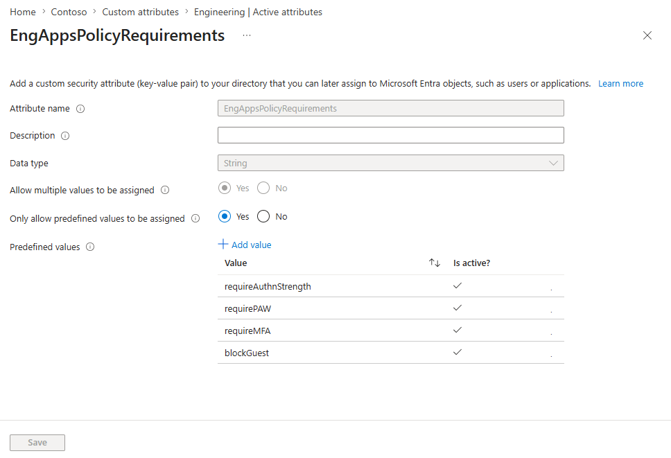
    
    > [!NOTE]
    >
    > 사용자 지정 보안 속성(Custom Security Attributes)은 Boolean 데이터 유형 생성을 지원하지만, 조건부 액세스 정책(Conditional Access Policy)은 **문자열(string)**만 지원합니다.
    

    속성 집합(Attribute Sets)과 사용자 지정 보안 속성(Custom Security Attributes)은 PowerShell 또는 MS Graph를 사용하여 관리할 수도 있습니다.

    ***Ref: [**PowerShell or MS Graph**](https://learn.microsoft.com/en-us/entra/fundamentals/custom-security-attributes-add?tabs=ms-powershell#powershell-or-microsoft-graph-api)***

#### Conditional Access Policy

사용자 지정 인증 강도([custom authentication strength](https://learn.microsoft.com/en-us/entra/identity/authentication/concept-authentication-strengths#custom-authentication-strengths))를 생성하고, 예를 들어 "Admin Approved Authentication Methods"와 같은 이름을 지정합니다.

SMS는 포함하지 않습니다.

이제 조건부 액세스 정책을 생성합니다:

- 조건부 액세스 정책을 테스트 사용자에게 할당합니다.

- 대상 리소스(Target resources)에서 다음 옵션을 선택합니다:

    - "**Select what this policy appies to**"에서 "**Resource (formerly cloud apps)**"를 선택합니다.
    - "**Include**"에서 "**Select resources**" > "**Select resources based on attributes**"를 선택하고, **Edit filter**에서 **Configure**를 **Yes**로 설정합니다.
    - 이전에 생성한 EngAppsPolicyRequirements 속성을 선택합니다.
    - Operator를 Contains로 설정하고, Value를 requireAuthenticationStrength로 지정합니다.

    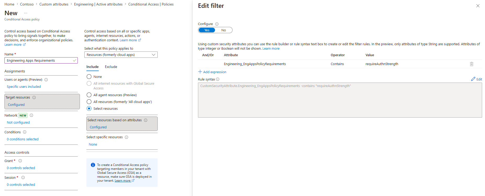

- Access controls > Grant에서 **Grant access**를 선택하고, **Require authentication strength**를 선택한 뒤, 사용자 지정 인증 강도인 **"Admin Approved authn methods"**를 선택합니다.

#### Assign custom security attributes to an application

이미 service principal을 사용하는 테스트 애플리케이션이 있다면, 다음 단계를 건너뛸 수 있습니다.

샘플 애플리케이션을 설정하려면 다음 중 하나를 수행할 수 있습니다:

- 데모 애플리케이션인 **Microsoft Entra SAML Toolkit**을 추가하고 엔터프라이즈 애플리케이션에 대해 SSO(Single Sign-On)를 활성화하거나

    [Enable single sign-on for an enterprise application](https://learn.microsoft.com/en-nz/entra/identity/enterprise-apps/add-application-portal-setup-sso)

    > [!NOTE]
    >
    > Sign-in 테스트 시 인증은 성공했으나 인증 후 페이지가 정상 로드되지 않음
    >
    > Microsoft Entra SAML Toolkit의 자체 문제일 가능성이 있어 보임. Azure AD Graph API가 dedicated되어 발생한 것으로 추정함.

- 문서 *“Quickstart: Get a token and call the Microsoft Graph API by using a console app's identity”*의 지침을 따라 진행합니다.

    [Quickstart: Get a token and call the Microsoft Graph API by using a console app's identity](https://learn.microsoft.com/en-us/entra/identity-platform/quickstart-v2-netcore-daemon)

**테스트 애플리케이션이 준비되면, 애플리케이션에 사용자 지정 보안 속성을 할당하세요.  **

***Ref: [Assign a custom security attribute to an application](https://learn.microsoft.com/en-us/entra/identity/conditional-access/concept-filter-for-applications#step-2-assign-a-custom-security-attribute-to-an-application)***

이 예에서는 "requireAuthnStrength" 속성을 할당합니다.

> [!IMPORTANT]
>
> **Attribute Assignment Administrator** 역할을 보유해야 합니다.


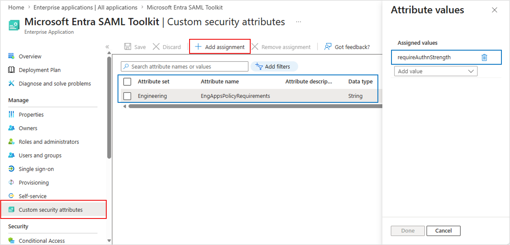

"Users and Groups"를 선택하고, **테스트 사용자**(Conditional Access 정책 할당에 사용한 동일한 사용자)를 반드시 추가하세요.

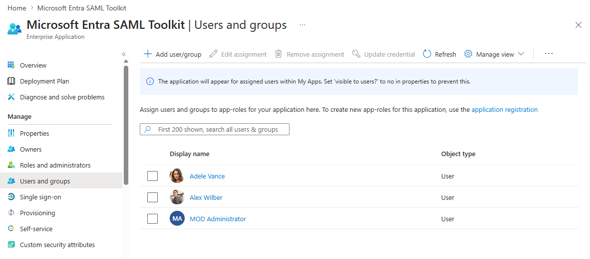

#### Test the policy

테스트 사용자로 https://myapps.microsoft.com/ 에 로그인하세요.  
MFA가 요청되면, 인증 강도 "Admin Approved authn methods"에 포함되지 않은 방법(예: SMS)을 사용하세요.

그 다음 테스트 애플리케이션을 검색하세요.  
이 예에서는 Microsoft Entra SAML Toolkit입니다.  
해당 애플리케이션을 선택하면, 다른 인증 방법을 사용하라는 요청을 받게 됩니다.

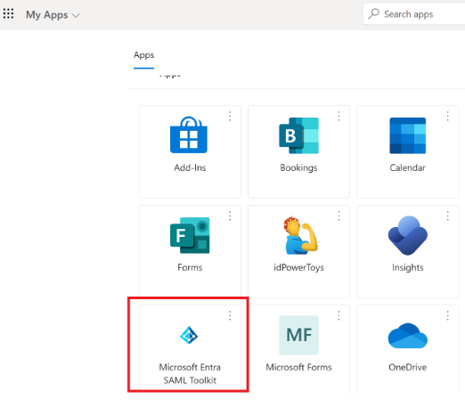

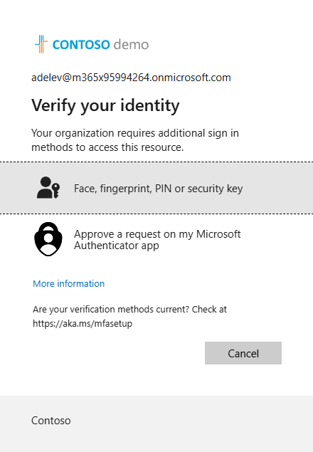

지시에 따라 인증을 완료하세요. 몇 분 후, 로그인 세부 정보에서 이전에 생성한 조건부 액세스 정책을 충족했음을 확인할 수 있습니다.

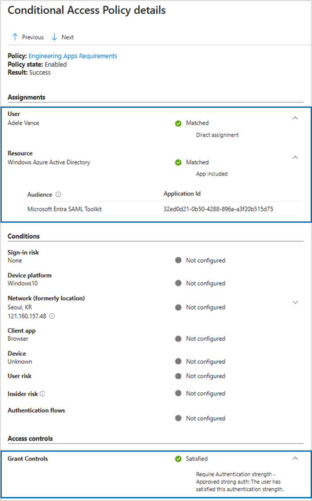

> [!TIP]
>
> Another example might be: allow access only from specific network locations.

### Protected Actions

[**Protected actions**](https://learn.microsoft.com/en-us/entra/identity/role-based-access-control/protected-actions-overview) in

Microsoft Entra ID의 보호된 작업([**Protected actions**](https://learn.microsoft.com/en-us/entra/identity/role-based-access-control/protected-actions-overview))은 조건부 액세스 정책이 할당된 권한을 의미하며, 사용자가 어떤 역할을 가지고 있거나 해당 권한을 어떻게 부여받았는지와 관계없이 추가적인 보호 계층을 적용하고자 할 때 사용됩니다.

> [!IMPORTANT]
>
> 정책 적용은 사용자가 보호된 작업을 수행하려고 시도할 때 이루어지며, 사용자 로그인 시점이나 규칙 활성화 시점에는 적용되지 않습니다. 사용자는 필요한 경우에만 프롬프트를 받습니다.
>
> 또한 PIM은 조건부 액세스 정책에 할당할 수 있으며, 사용자가 역할을 활성화할 때 해당 정책이 적용됩니다.  
> PIM 역할 활성화와 보호된 작업을 함께 사용하면 더 강력한 보호를 제공할 수 있습니다.


예를 들어, 관리자가 조건부 액세스 정책을 업데이트할 수 있도록 하려면  
먼저 피싱 대응 MFA(Phishing-resistant MFA) 정책을 충족하도록 요구하거나,  
조건부 액세스 정책의 디바이스 필터를 사용해 특권 액세스 워크스테이션(Privileged Access Workstation)에서만 접근하도록 제한하거나,  
조건부 액세스의 로그인 빈도(Session Controls)를 사용해 더 짧은 세션 시간 제한을 구성할 수 있습니다.

***Ref: [device filters](https://learn.microsoft.com/en-us/entra/identity/conditional-access/concept-condition-filters-for-devices)***

***Ref: [sign-in frequency session controls](https://learn.microsoft.com/en-us/entra/identity/conditional-access/howto-conditional-access-session-lifetime#user-sign-in-frequency)***


조건부 액세스 정책은 다음 영역의 **제한된 권한 집합(limited set of permissions)**에 적용될 수 있습니다:  

- 조건부 액세스 정책 관리 
- 테넌트 간 액세스 설정 관리 
- 네트워크 위치를 정의하는 사용자 지정 규칙 
- 보호된 작업(Protected action) 관리

다음은 초기 권한 목록입니다. 보호된 작업과 함께 사용할 수 있는 권한은 무엇인가요?

***Ref: [What permissions can be used with protected actions?](https://learn.microsoft.com/en-us/entra/identity/role-based-access-control/protected-actions-overview#what-permissions-can-be-used-with-protected-actions)***

| 권한 | 설명 |
| --- | --- |
| microsoft.directory/conditionalAccessPolicies/basic/update | 조건부 액세스 정책의 기본 속성을 업데이트합니다. |
| microsoft.directory/conditionalAccessPolicies/create | 조건부 액세스 정책을 생성합니다. |
| microsoft.directory/conditionalAccessPolicies/delete | 조건부 액세스 정책을 삭제합니다. |
| microsoft.directory/conditionalAccessPolicies/basic/update | 조건부 액세스 정책의 기본 속성을 업데이트합니다. |
| microsoft.directory/conditionalAccessPolicies/create | 조건부 액세스 정책을 생성합니다. |
| microsoft.directory/conditionalAccessPolicies/delete | 조건부 액세스 정책을 삭제합니다. |
| microsoft.directory/crossTenantAccessPolicy/allowedCloudEndpoints/update | 테넌트 간 액세스 정책의 허용된 클라우드 엔드포인트를 업데이트합니다. |
| microsoft.directory/crossTenantAccessPolicy/default/b2bCollaboration/update | 기본 테넌트 간 액세스 정책의 Microsoft Entra B2B 협업 설정을 업데이트합니다. |
| microsoft.directory/crossTenantAccessPolicy/default/b2bDirectConnect/update | 기본 테넌트 간 액세스 정책의 Microsoft Entra B2B Direct Connect 설정을 업데이트합니다. |
| microsoft.directory/crossTenantAccessPolicy/default/crossCloudMeetings/update | 기본 테넌트 간 액세스 정책의 크로스 클라우드 Teams 회의 설정을 업데이트합니다. |
| microsoft.directory/crossTenantAccessPolicy/default/tenantRestrictions/update | 기본 테넌트 간 액세스 정책의 테넌트 제한 설정을 업데이트합니다. |
| microsoft.directory/crossTenantAccessPolicy/partners/b2bCollaboration/update | 파트너용 테넌트 간 액세스 정책의 Microsoft Entra B2B 협업 설정을 업데이트합니다. |
| microsoft.directory/crossTenantAccessPolicy/partners/b2bDirectConnect/update | 파트너용 테넌트 간 액세스 정책의 Microsoft Entra B2B Direct Connect 설정을 업데이트합니다. |
| microsoft.directory/crossTenantAccessPolicy/partners/create | 파트너용 테넌트 간 액세스 정책을 생성합니다. |
| microsoft.directory/crossTenantAccessPolicy/partners/crossCloudMeetings/update | 파트너용 테넌트 간 액세스 정책의 크로스 클라우드 Teams 회의 설정을 업데이트합니다. |
| microsoft.directory/crossTenantAccessPolicy/partners/delete | 파트너용 테넌트 간 액세스 정책을 삭제합니다. |
| microsoft.directory/crossTenantAccessPolicy/partners/tenantRestrictions/update | 파트너용 테넌트 간 액세스 정책의 테넌트 제한 설정을 업데이트합니다. |
| microsoft.directory/deletedItems/delete | 복구할 수 없는 개체를 영구적으로 삭제합니다. |
| microsoft.directory/namedLocations/basic/update | 네트워크 위치를 정의하는 사용자 지정 규칙의 기본 속성을 업데이트합니다. |
| microsoft.directory/namedLocations/create | 네트워크 위치를 정의하는 사용자 지정 규칙을 생성합니다. |
| microsoft.directory/namedLocations/delete | 네트워크 위치를 정의하는 사용자 지정 규칙을 삭제합니다. |
| microsoft.directory/resourceNamespaces/resourceActions/authenticationContext/update | Microsoft 365 RBAC 리소스 작업의 조건부 액세스 인증 컨텍스트를 업데이트합니다. |

보호된 작업(Protected actions)을 사용하려면 다음 단계를 수행해야 한다.

1. **조건부 액세스 정책(CAP) 생성** 보호된 작업은 **조건부 액세스 인증 컨텍스트**를 사용하므로, 먼저 인증 컨텍스트를 구성한 뒤 이를 조건부 액세스 정책에 추가해야 한다.또한 이 CAP는 **테스트 사용자**에게 할당해야 하며, 해당 사용자는 최소한 Conditional Access Administrator 역할을 가지고 있어야 한다.

1. **보호된 작업 추가** 조건부 액세스 인증 컨텍스트를 사용하여 하나 이상의 권한에 조건부 액세스 정책을 연결한다.

    - 이를 위해 Entra 관리자 포털에서 **Identity > Roles & admins > Protected actions**로 이동한다.
    - 이후 구성해 둔 **조건부 액세스 인증 컨텍스트(Conditional Access authentication context)**를 선택한다.
    - 마지막으로 권한 목록에서 **조건부 액세스로 보호할 권한을 선택**한다.  
        이 예에서는 Named Locations의 **업데이트, 생성, 삭제** 권한을 보호 대상으로 설정한다.

        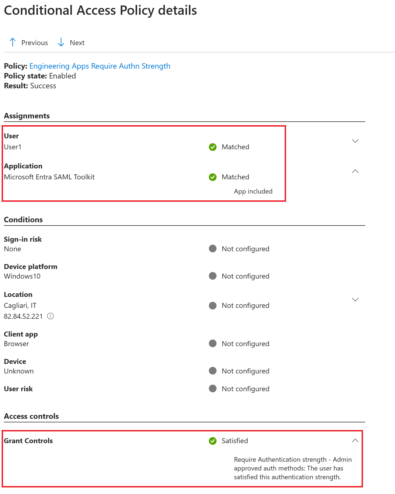

1. 사용자가 보호된 작업(Protected action)을 수행하면, 해당 작업을 실행하기 전에 조건부 액세스 정책 요구 사항을 충족해야 한다.사용자가 정책을 어떻게 충족하도록 안내받는지 이해하려면 **보호된 작업 테스트([Test a protected action](https://learn.microsoft.com/en-us/entra/identity/role-based-access-control/protected-actions-add#step-3-test-protected-actions))** 단계를 진행해보면 된다.

이 예제에서는 사용자가 Named Location을 업데이트하거나 생성하기 전에, **이전에 만들어 둔 Authentication Strength(여기에는 SMS가 포함되지 않음)**을 충족해야 한다.

- 테스트 사용자 계정으로 Entra Admin Portal 또는 Azure Portal에 로그인한다.MFA가 필요하다면, **SMS**를 사용해 인증한다.(SMS는 Authentication Strength에 포함되지 않은 방법이므로, 이후 보호된 작업을 수행할 때 다시 강한 인증을 요구받게 된다.)
- 로그인 후 **Conditional Access**로 이동하여 새로운 **Named Location(IP 범위)**을 생성하려고 시도한다.

이 과정을 통해, 사용자가 보호된 작업을 수행할 때 Authentication Strength 요구 사항을 충족해야 한다는 점을 직접 확인할 수 있다.

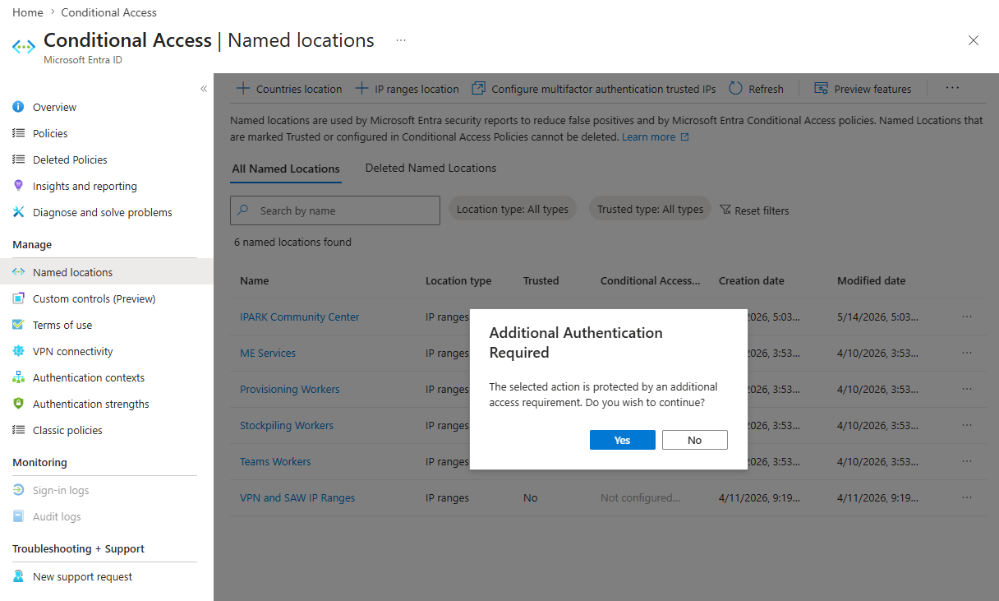


## Browser Session Control

## Sign-in frequency (SIF)

## Continuous Access Evaluation CAE

## Token Protection


## B2B Scenarios

## Appendix

### Best Practices for the Break Glass Account

1. **클라우드 전용 계정 생성** 

    온프레미스 AD에서 동기화되는 계정이 아닌, Microsoft Entra ID에서 직접 생성한 계정이어야 합니다.

    이는 온프레미스 장애나 동기화 문제로 인해 계정이 잠기는 상황을 방지하기 위함입니다.

1. **Global Administrator 역할 부여**

    Break Glass 계정은 비상 상황에서 모든 작업을 수행할 수 있어야 하므로 Global Administrator 역할을 부여합니다.

1. **강력한 비밀번호 설정**

    매우 길고 복잡한 비밀번호를 설정합니다.

    비밀번호 만료 정책을 적용하지 않습니다.

    비밀번호는 안전한 장소(금고 등)에 보관합니다.

1. **Conditional Access 정책에서 명시적으로 제외**

    모든 CA 정책에서 Break Glass 계정을 Exclusion 처리해야 합니다.

    특히 MFA, 위치 제한, 디바이스 기반 정책 등에서 제외해야 비상 상황에서 잠기지 않습니다.

1. **MFA 적용 금지**

    비상 상황에서는 MFA가 장애 요소가 될 수 있으므로 Break Glass 계정에는 MFA를 적용하지 않습니다.

1. **로그인 모니터링 구성**

    Break Glass 계정은 평상시 사용되지 않아야 하므로 로그인 발생 시 즉시 알림을 받을 수 있도록 설정합니다.

    Sign-in logs에서 정기적으로 로그인 여부를 점검합니다.

1. **접근 절차 문서화**

    누가, 언제, 어떤 절차로 이 계정에 접근할 수 있는지 명확히 문서화합니다.

    최소 두 명 이상의 승인 절차를 요구하는 것이 좋습니다.


