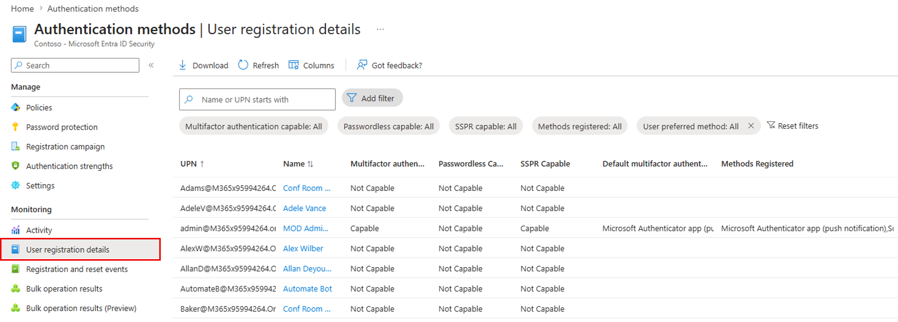
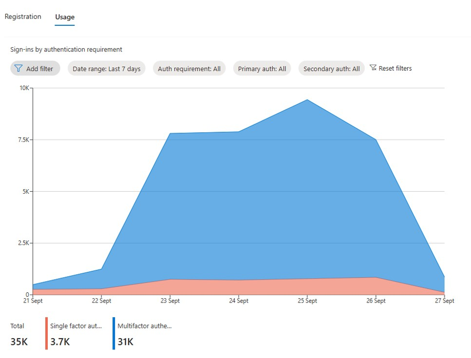
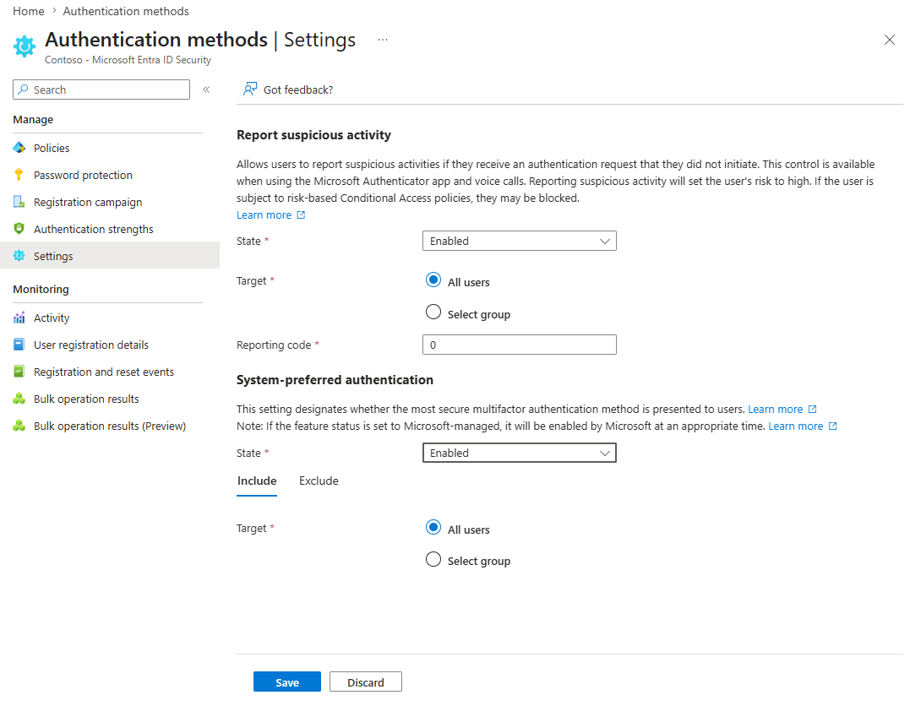
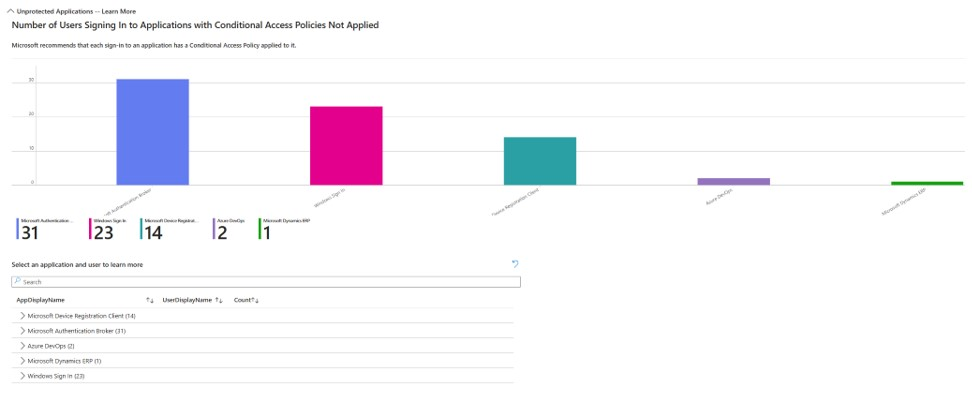
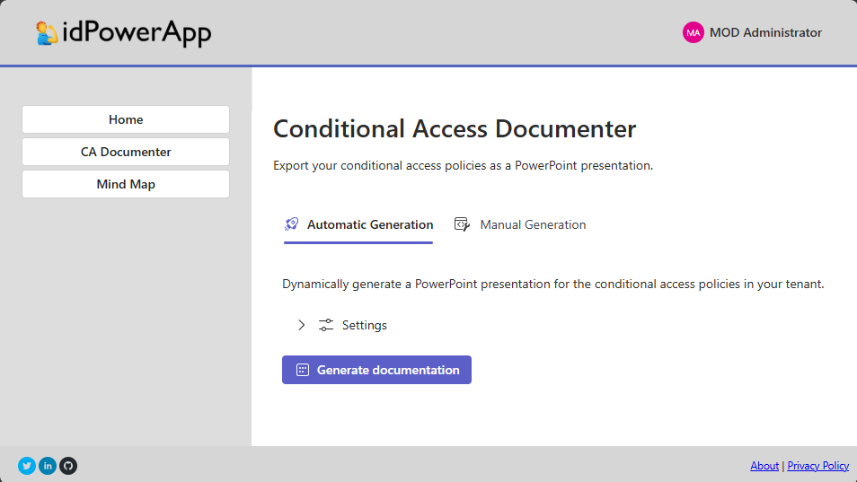
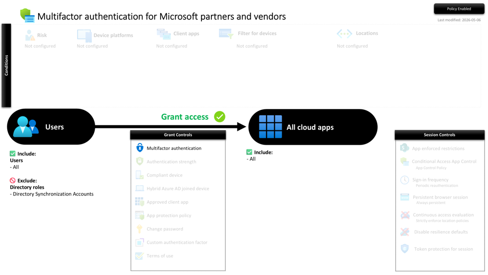
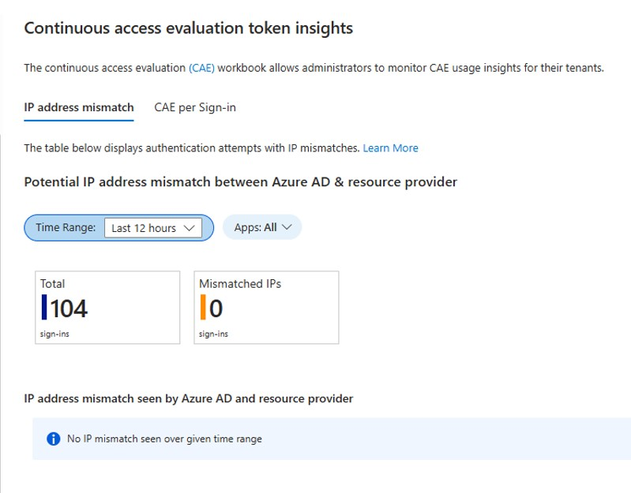
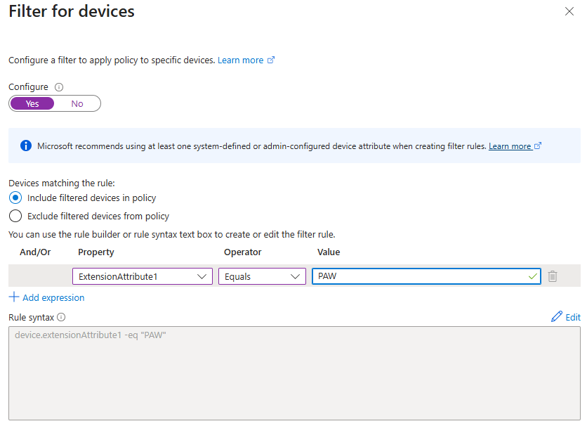

# Solution Optimization - Entra Identity Protection and Advanced Conditional Access Policies


이 기술 가이드의 목표는 ID 보호 및 조건부 접근 정책의 현재 채택 현황을 검토하는 방법론을 제공하여 고객의 보안 태세를 개선하기 위해 최적화하는 데 있습니다. 고객이 Entra ID 및/또는 Zero Trust Foundation 평가에 대해 주문형 평가를 받았는지 CSAM에 확인해 주시기 바랍니다. 이 참여 보고서는 출발점으로 활용할 수 있습니다.

## Basic configuration

검토는 CAP와 관련된 기본 설정 설정을 먼저 확인하며 시작합니다.

**처음에는 인증 방법을 검토할 수 있습니다.** 이 방법은 조직이 어떤 옵션을 사용하는지 알려줍니다. MFA 검증 방법은 동일하지 않다는 점을 명심하세요. SMS나 음성 통화 같은 '레거시' MFA 방법은 Microsoft Authenticator App만큼 안전하지 않고, OATH 토큰 등도 있습니다


- [ ] 가장 강력한 검증 방법이 활성화되어 있는지 확인하세요.

- [ ] 기존 SSPR / Multifactor authentication에서 Authentication methods으로 마이그레이션 상태를 확인합니다.

    
    
    > [!NOTE]
    >
    > [How to migrate MFA and SSPR policy settings to the Authentication methods policy for Microsoft Entra ID](https://learn.microsoft.com/en-us/entra/identity/authentication/how-to-authentication-methods-manage)
    

**[Usage and Insight](https://entra.microsoft.com/#view/Microsoft_AAD_IAM/AuthenticationMethodsMenuBlade/~/AuthMethodsActivity/menuId/AuthMethodsActivity)를 활용해 최종 사용자의 강력한 인증에 대한 준비도를 확인할 수 있습니다.**

아래 세 가지 보고서를 살펴보세요:

- Users capable of Azure multifactor authentication.
- Users capable of Passwordless authentication.
- Users capable of self-service password reset.


모든 사용자는 강력한 인증을 받을 준비가 되어 있어야 합니다. 그렇지 않은 경우, 고객에게 Identity Protection registration 정책을 이용하도록 권장하십시오.

인증 방식별로 등록된 사용자를 검토하십시오. 모든 사용자가 MS Authenticator를 등록한 상태여야 합니다.


고객에게 [Registration Campaign]()을 실행하여 사용자들이 MS Authenticator를 구성하도록 유도하십시오.

> [!NOTE]
>
> Registration Campaign은 전화 통화나 SMS 같은 약한 MFA 방식으로 이미 등록한 사용자들에게 영향을 준다는 점을 기억하세요.

등록에 대한 더 많은 정보가 필요하다면 [User registration details](https://entra.microsoft.com/#view/Microsoft_AAD_IAM/AuthenticationMethodsMenuBlade/~/UserRegistrationDetails/menuId/AuthMethodsActivity)를 사용하세요.



**이제 단일 요소 인증과 다중 요소 인증의 비율을 확인해 볼 시간입니다.**



> [!NOTE]
>
> 인증 요구 사항별 로그인(Sign-ins by authentication requirement)은 Microsoft Entra ID에서 단일 요소 인증과 다중 요소 인증이 각각 요구된 성공적인 사용자 대화형 로그인 수를 보여줍니다.
> 타사 MFA 공급자에 의해 MFA가 적용된 로그인은 포함되지 않습니다.

다음 기능들을 고객이 활성화하도록 검토하고 권장하세요:

- [ ] **의심스러운 활동 신고**
- [ ] **시스템 기본 다중 요소 인증(System-preferred multifactor authentication)**



>TODO: 위 내용에 대한 설명을 더 추가

**알려진 위치가 정의되어 있는지 확인하세요.**

조건부 액세스에서 명명된 위치(named locations)를 구성하고, VPN 대역을 [Defender for Cloud Apps](https://learn.microsoft.com/en-us/defender-cloud-apps/ip-tags#create-an-ip-address-range)에 추가하는 것이 중요합니다.
신뢰되거나 알려진 위치로 표시된 명명된 위치에서 발생한 로그인은 Microsoft Entra ID Protection의 위험 계산 정확도를 향상시킵니다.
이러한 위치에서 인증하면 사용자의 위험도가 낮아지며, 이는 환경에서 특정 탐지 항목의 오탐(false positive)을 줄이는 데 도움이 됩니다.

## Basic Conditional Access Policies

우리는 최소한 고객이 다음과 같은 보호 조치를 갖추고 있어야 한다고 믿습니다.
아래 시나리오를 다루는 조건부 액세스 정책(CAP)이 있는지 고객과 함께 검토하세요.

- **관리자에 대한 강력한 인증**

    MFA는 최소 요구사항입니다.
    
    필요하다면 인증 강도(Authentication Strength)를 활용해 더 강력한 인증(예: 피싱 저항 MFA, 패스워드리스 MFA 등)을 권장할 수 있습니다.

- **보안 정보(Security info) 등록 보호**

    강력한 인증, 신뢰할 수 있는 위치, 규정 준수 장치(compliant device) 등의 사용을 요구하도록 구성할 수 있습니다.

- **디바이스 등록 및 Intune 등록 보호**

    Entra에서의 디바이스 등록(Entra Join, Entra Registered)과 Intune 등록 역시 보호되어야 합니다.

    여기에는 강력한 인증, 신뢰할 수 있는 위치 등이 포함될 수 있습니다.

- **레거시 인증 차단**

    기본 인증(Basic Authentication)은 모든 테넌트의 Exchange Online에서 이미 비활성화되어 있으며 다시 활성화할 수 없습니다. 그럼에도 불구하고 Entra ID 수준에서 레거시 인증을 차단하는 것을 권장합니다.

    **레거시 인증 사용 식별:** [Sign-in logs](https://learn.microsoft.com/en-us/entra/identity/conditional-access/policy-block-legacy-authentication#identify-legacy-authentication-use) 또는 [legacy authentication workbook](https://learn.microsoft.com/en-us/entra/identity/monitoring-health/workbook-legacy-authentication)을 통해 레거시 인증 사용 여부를 파악할 수 있습니다.

    - **[Sign-in logs](https://learn.microsoft.com/en-us/entra/identity/conditional-access/policy-block-legacy-authentication#identify-legacy-authentication-use)**

        **레거시 인증 사용 식별**

        1. 사용자가 레거시 인증을 사용하는 클라이언트 앱을 보유하고 있는지 확인하려면, 관리자는 다음 단계에 따라 로그인 로그에서 관련 지표를 확인할 수 있습니다.

        1. Microsoft Entra 관리 센터에 Reports Reader 이상 권한으로 로그인합니다.

        1. Entra ID > Monitoring & health > Sign-in logs 로 이동합니다.

        1. Columns > Client App 을 선택해 ‘Client App’ 열이 표시되지 않았다면 추가합니다.

        1. Add filters > Client App 을 선택하고, 모든 레거시 인증 프로토콜을 선택한 후 Apply 를 클릭합니다.

            동일한 단계를 User sign-ins (non-interactive) 탭에서도 수행합니다.

        이 필터링을 통해 레거시 인증 프로토콜로 시도된 로그인들을 확인할 수 있습니다.

        각 로그인 항목을 클릭하면 더 자세한 정보를 볼 수 있으며, Basic Info 탭의 ‘Client App’ 필드에서 어떤 레거시 인증 프로토콜이 사용되었는지 확인할 수 있습니다.
        이 로그들은 레거시 인증에 의존하는 클라이언트를 사용 중인 사용자를 식별하는 데 도움이 됩니다.

        > [!NOTE]
        >
        > 1. **구형 Microsoft Office 클라이언트**
        >
        >    - **Office 2013 또는 그 이전 버전**
        >
        >    Modern Authentication(ADAL)을 지원하지 않아 기본 인증만 사용→ MFA 적용 불가, 보안 취약
        >
        > 1. **메일 프로토콜 기반 앱 (POP/IMAP/SMTP AUTH)**
        >
        >    - **POP3 클라이언트**
        >    
        >    - **IMAP 클라이언트**
        >    
        >    - **SMTP AUTH를 사용하는 앱/스크립트**
        >    
        >    대부분 Basic Auth 기반으로 동작→ 비밀번호만으로 인증, 토큰 기반 인증 미지원
        >
        > 1. **구형 Exchange ActiveSync(EAS) 클라이언트**
        >
        >    - 오래된 모바일 메일 앱(Android 기본 메일 앱의 구버전 등)
        >    - OAuth2를 지원하지 않는 버전→ Modern Auth 미지원
        >
        > 1. **기타 Basic Authentication 기반 앱**
        >
        >    - 자체 개발된 레거시 애플리케이션
        >    
        >    - OAuth2/Modern Auth를 구현하지 않은 자동화 스크립트
        >    
        >    - 오래된 Outlook 플러그인 또는 타사 메일 클라이언트

    - **[legacy authentication workbook](https://learn.microsoft.com/en-us/entra/identity/monitoring-health/workbook-legacy-authentication)**

        **사전 요구 사항(Prerequisites)**

        Microsoft Entra ID에서 Azure Workbooks를 사용하려면 다음이 필요합니다:
        
        - Premium P1 라이선스가 포함된 Microsoft Entra 테넌트
        
        - Log Analytics 작업 영역(Log Analytics workspace) 및 해당 작업 영역에 대한 액세스 권한
        
        - Azure Monitor 및 Microsoft Entra ID에 대한 적절한 역할(Role)

- **위험한 로그인(Risky Sign-in):** 강력한 인증, 규정 준수 장치(compliant device), Conditional Access App Control 등을 권장할 수 있습니다.

- **위험한 사용자(Risky User):** SSPR, 규정 준수 장치, 차단 등의 조치가 필요할 수 있습니다.

- **모든 사용자에 대해 MFA 요구:** 모든 사용자는 어떤 리소스에 접근하더라도 강력한 인증을 충족해야 합니다. 고객이 모든 사용자에게 강력한 인증을 적용하는 조건부 액세스 정책(CAP)을 보유하고 있는지 확인하세요.

Finally you can use the workbook Conditional Access Gap Analyzer to find :

Legacy Authentication.
Unprotected Apps.
Compromised User Sign-ins.
Unprotected Locations.
Unprotected Named locations.


**마지막으로, ‘Conditional Access Gap Analyzer’ 워크북을 사용하여 다음 항목들을 확인할 수 있습니다:**

- 레거시 인증(Legacy Authentication)
- 보호되지 않은 앱(Unprotected Apps)
- 위협에 노출된 사용자 로그인(Compromised User Sign-ins)
- 보호되지 않은 위치(Unprotected Locations)
- 보호되지 않은 명명된 위치(Unprotected Named Locations)

> [!IMPORTANT]
>
> Log Analytics 작업 영역(Log Analytics workspace) 및 해당 작업 영역에 대한 액세스 권한

Conditional Access Gap Analyzer 워크북을 사용하여 ‘보호되지 않은 앱(Unprotected Apps)’을 확인하는 예:



> [!NOTE]
>
> 고객에게 [Conditional Access Documenter](https://idpowertoys.merill.net/ca)를 사용해 조건부 액세스 정책(CA)을 보기 좋은 PowerPoint 슬라이드로 내보내 분석할 수 있도록 안내할 수 있습니다.
>
> 단, CA Documenter는 Microsoft의 공식 1st-party 도구가 아니라는 점을 반드시 고객에게 알려주세요.  CA Documenter는 Entra ID 제품 그룹(PG) 팀의 한 엔지니어가 개발한 도구입니다.
>
> 
>
> **Conditional Access Policy Documentation:**
>
> 

## Advanced scenarios

고객이 추가적인 보안 통제가 필요한 시나리오가 있는지 함께 논의하세요.

아래 섹션에서는 솔루션 최적화 과정에서 활용할 수 있는 몇 가지 시나리오를 제공합니다.

### **1. 중요 애플리케이션 접근(Accessing critical applications)**

고객에게 어떤 애플리케이션이 ‘중요 애플리케이션’인지 확인하고, 다음과 같은 통제를 고려할 수 있습니다:

- **인증 강도 요구(Require authentication strength)** 예: 피싱 저항 MFA + 규정 준수 장치(compliant device) 요구
- **로그인 빈도(Sign-in Frequency)** 예: 중요 애플리케이션 접근 시마다 매번 로그인 요구

### **2. SharePoint Online & OneDrive의 중요 데이터 보호**

대부분의 고객은 O365(특히 SharePoint Online)를 보호하기 위한 정책을 가지고 있으며, 예를 들어 SPO 접근 시 MFA를 요구합니다.하지만 **민감한 데이터를 포함한 특정 사이트**는 더 강력한 제한이 필요할 수 있습니다.

이 경우 고객은 **Authentication Context**를 사용하여 다음과 같은 추가 보안 조치를 적용할 수 있습니다:

- 규정 준수 장치 요구
- 인증 강도 요구

또한, SPO에서 단계적 인증(step-up authentication)을 구현하는 방법은 *Advanced CAPs 기술 가이드*의 단계별 예제를 활용해 데모할 수 있습니다.

>TODO: 문서 생성 및 문서 내 링크 추가 필요!

### **3. BYOD(Bring Your Own Device)**

고객에게 BYOD 전략을 질문하세요:

- 개인 기기에서 리소스 접근을 허용하는가?
- 해당 기기들은 MDM으로 관리되는가?

예시로, 고객은 다음과 같은 보안 조치를 고려할 수 있습니다:

- **지속적 브라우저 세션 금지(No persistent browser session)**
- **로그인 빈도: 매번(Sign-in frequency: Every time)**
- **Conditional Access App Control 사용**

### **4. 토큰 탈취 및 재사용(Token Theft and Reuse)**

고객에게 토큰 탈취 방지 전략이 있는지 확인하세요.

고객은 다음과 같은 보안 조치를 적용할 수 있습니다:

- **Token Protection**

    >TODO: Token Protection 링크에 대하여 확인 필요!

- **CAE(Continuous Access Evaluation)**

    참고: *Continuous Access Evaluation Insights* 워크북을 사용하여Entra와 리소스 제공자 간의 **IP 불일치(Mismatched IP)** 여부를 확인할 수 있습니다.

    

### **5. 클라우드 관리(Cloud Administration)**

클라우드 환경에서의 관리자 보안을 강화하기 위해 다음과 같은 다양한 통제를 적용할 수 있습니다:

- **PAW(Privileged Access Workstation) 디바이스만 허용하도록 디바이스 필터링 사용**

- **PIM(Role elevation)에서 역할 상승 시 Authentication Context 적용**

- **Authentication Strength 사용** (예: 피싱 저항 MFA 요구)

### **6. 워크로드 ID(Workload Identities)는 어떻게 할까?**

워크로드 ID 보호를 위해 고객은 다음과 같은 조건부 액세스를 고려할 수 있습니다:

- **위험 기반 조건부 액세스(Risk-based CA for workload identities)** 의심스러운 애플리케이션 활동을 자동으로 차단합니다.
- **위치 기반 조건부 액세스(Location-based CA for workload identities)**

### **7. B2B 시나리오(B2B Scenarios)**

고객에게 다음 사항을 질문해 보세요:

- **Cross-tenant access settings(테넌트 간 액세스 설정)**을 어떻게 구성하고 있는가


## Appendix

### PAW(Privileged Access Workstation) 디바이스만 허용하도록 디바이스 필터링 사용

#### 디바이스의 속성 업데이트

```powershell
Import-Module Microsoft.Graph.Identity.DirectoryManagement

$params = @{ "extensionAttribute1" = "PAW" }

Update-MgDevice -DeviceId $deviceId -BodyParameter $params    
```

> [!NOTE]
>
> **Update-MgDevice** - **Permissions**
>
> | Permission type | Permissions (from least to most privileged) |
> | --- | --- |
> | Delegated (work or school account) | Directory.AccessAsUser.All, |
> | Delegated (personal Microsoft account) | Not supported |
> | Application | Device.ReadWrite.All, Directory.ReadWrite.All, |

#### CAP의 조건에 디바이스 필터링 구현



### PIM(Role elevation)에서 역할 상승 시 Authentication Context 적용

>TODO

### Authentication methods and features

>TODO

### 유용한 KQL 쿼리 예시 (Log Analytics 구독 필요)

고객이 로그인 로그를 Log Analytics로 내보냈다면, KQL 쿼리를 사용하여 추가 분석을 수행하고 조건부 액세스(CA)가 사용자 인증에 어떤 영향을 미치는지에 대한 더 많은 데이터를 얻을 수 있습니다. 아래는 KQL 쿼리 예시들입니다.

#### Sucessful authentication where no CA has been applied - you can leverage Unprotected Applications report in Conditional Access Gap Analyzer for similar results.
 
```kusto
SigninLogs | where TimeGenerated >= ago(30d) | where ConditionalAccessStatus == "notApplied" and ResultType == 0 | summarize Nb = count() by AppDisplayName | order by Nb
```
 
```kusto
SigninLogs | where TimeGenerated >= ago(30d) | where ConditionalAccessStatus == "notApplied" and ResultType == 0 | project TimeGenerated, ResultType, ResultDescription, UserPrincipalName, Identity, Location, IPAddress, AppDisplayName,Status, AuthenticationRequirement, AuthenticationRequirementPolicies, ConditionalAccessStatus | order by TimeGenerated desc
```

#### Successful Authentication with Single Factor
 
```kusto
SigninLogs | where TimeGenerated >= ago(30d) | where ResultType == 0 and AuthenticationRequirement == "singleFactorAuthentication" | project TimeGenerated, ResultType, ResultDescription, UserPrincipalName, Identity, Location, IPAddress, AppDisplayName,Status, AuthenticationRequirement, AuthenticationRequirementPolicies, ConditionalAccessStatus | order by TimeGenerated desc
```

#### Successful access to aka.ms/mysecurityinfo (My Signin) with Single Factor and not from named locations

```kusto
SigninLogs | where TimeGenerated > ago(30d) | where AppDisplayName == "My Signins" and ResultType == 0 and AuthenticationRequirement == "singleFactorAuthentication" and NetworkLocationDetails == "[]" | project TimeGenerated, ResultType, UserPrincipalName, Identity, Location, NetworkLocationDetails, AppDisplayName, AppId, AuthenticationRequirement, ConditionalAccessStatus, IPAddress
``` 

#### Seccessful Risky sign-in wih single factor.

```kusto
SigninLogs | where TimeGenerated >= ago(30d) | where RiskLevelAggregated in ("medium", "high") | where ResultType == 0 and AuthenticationRequirement == "singleFactorAuthentication" | project TimeGenerated, ResultType, UserPrincipalName, Identity, Location, NetworkLocationDetails, AppDisplayName, AppId, AuthenticationRequirement, ConditionalAccessStatus, IPAddress, RiskLevelAggregated
```

#### Weak MFA methods - Better to use Uage and Insight

```kusto
SigninLogs | where TimeGenerated > ago(30d) | extend AuthDetails = parse_json(AuthenticationDetails) // Convert string to JSON | mv-expand AuthDetails // Expand authentication steps if multiple exist | extend AuthMethod = tostring(AuthDetails.authenticationMethod) // Extract MFA method //| where isnotempty(AuthMethod) // Ensure the field is not empty | summarize count() by AuthMethod
```

### Statistics about Application of CAP

```kusto
SigninLogs | where TimeGenerated >= ago(1d) | mv-expand ConditionalAccessPolicies | extend Policy = parse_json(ConditionalAccessPolicies) | summarize SuccessCount = countif(tostring(Policy.result) == "success"), FailureCount = countif(tostring(Policy.result) == "failure"), NotAppliedCount = countif(tostring(Policy.result) == "notApplied") by PolicyName = tostring(Policy.displayName)
```

---

## Next Steps

[Advanced Conditional Access - Deep Dive](Advanced-Conditional-Access-Deep-Dive)

[Entra Identity Protection - Deep Dive](Entra-Identity-Protection-Deep-Dive)

> [!NOTE]
>
> [VBD Delivery Guidance](VBD-Delivery-Guidance)

## More Reference

[Ref - Microsoft Entra ID Protection - **Risk Detections**](Ref-Microsoft-Entra-ID-Protection-Risk-Detections)

[Ref - Risk-based access policies](Ref-Risk-based-access-policies)

[Ref - Protect agent identities with Microsoft Entra](Ref-Protect-agent-identities-with-Microsoft-Entra.md)