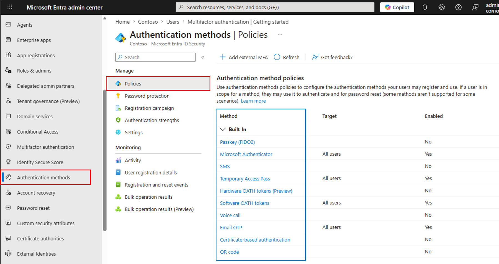
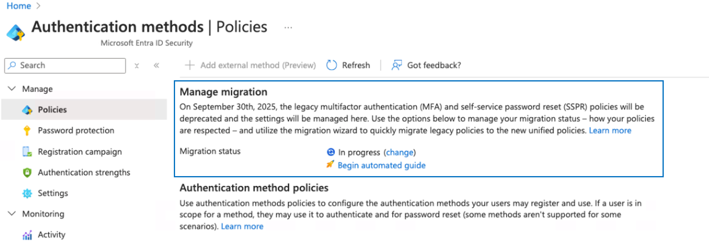
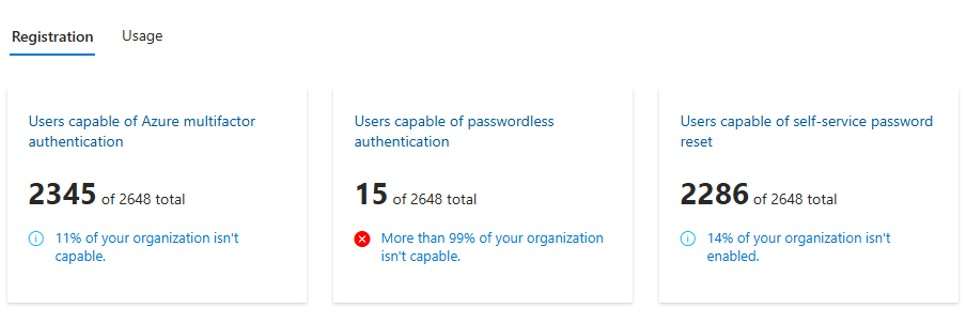
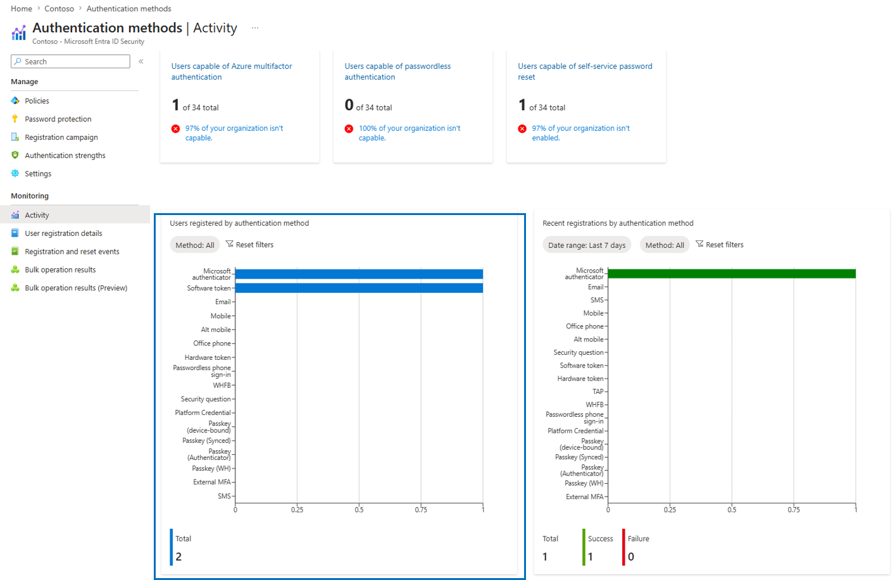

# Solution Optimization - Entra Identity Protection and Advanced Conditional Access Policies

이 기술 가이드의 목표는 ID 보호 및 조건부 접근 정책의 현재 채택 현황을 검토하는 방법론을 제공하여 고객의 보안 태세를 개선하기 위해 최적화하는 데 있습니다. 고객이 Entra ID 및/또는 Zero Trust Foundation 평가에 대해 주문형 평가를 받았는지 CSAM에 확인해 주시기 바랍니다. 이 참여 보고서는 출발점으로 활용할 수 있습니다.

## Basic configuration

검토는 CAP와 관련된 기본 설정 설정을 먼저 확인하며 시작합니다.

처음에는 인증 방법을 검토할 수 있습니다. 이 방법은 조직이 어떤 옵션을 사용하는지 알려줍니다. MFA 검증 방법은 동일하지 않다는 점을 명심하세요. SMS나 음성 통화 같은 '레거시' MFA 방법은 Microsoft Authenticator App만큼 안전하지 않고, OATH 토큰 등도 있습니다

- [ ] 가장 강력한 검증 방법이 활성화되어 있는지 확인하세요.

- [ ] 기존 SSPR / Multifactor authentication에서 Authentication methods으로 마이그레이션 상태를 확인합니다.

    
    
    > [[NOTE]]
    >
    > [How to migrate MFA and SSPR policy settings to the Authentication methods policy for Microsoft Entra ID](https://learn.microsoft.com/en-us/entra/identity/authentication/how-to-authentication-methods-manage)
    

[Usage and Insight](https://entra.microsoft.com/#view/Microsoft_AAD_IAM/AuthenticationMethodsMenuBlade/~/AuthMethodsActivity/menuId/AuthMethodsActivity)를 활용해 최종 사용자의 강력한 인증에 대한 준비도를 확인할 수 있습니다.

아래 세 가지 보고서를 살펴보세요:

- Users capable of Azure multifactor authentication.
- Users capable of Passwordless authentication.
- Users capable of self-service password reset.

모든 사용자는 강력한 인증을 받을 준비가 되어 있어야 합니다. 그렇지 않은 경우, 고객에게 Identity Protection registration 정책을 이용하도록 권장하십시오.

인증 방식별로 등록된 사용자를 검토하십시오. 모든 사용자가 MS Authenticator를 등록한 상태여야 합니다.

고객에게 [Registration Campaign]()을 실행하여 사용자들이 MS Authenticator를 구성하도록 유도하십시오.

!!! NOTE
    이것은 Note입니다.

:::note
    이것은 Note입니다.



