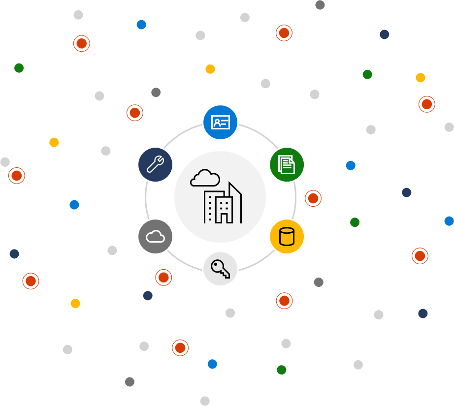
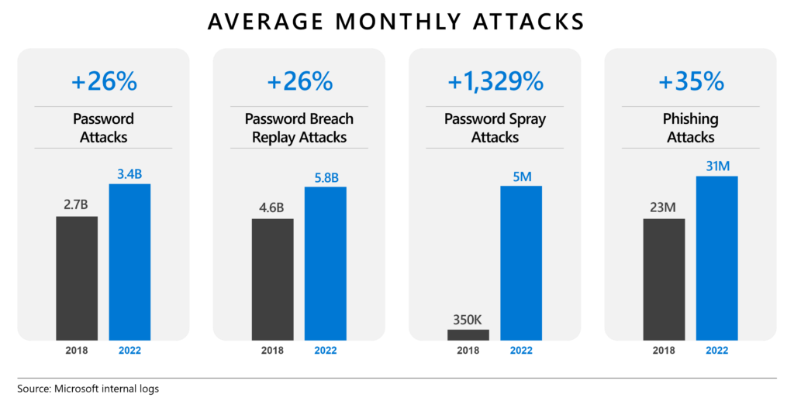
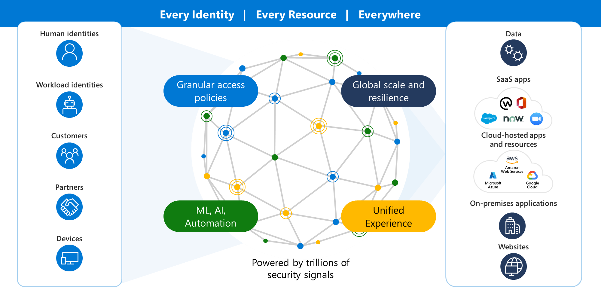
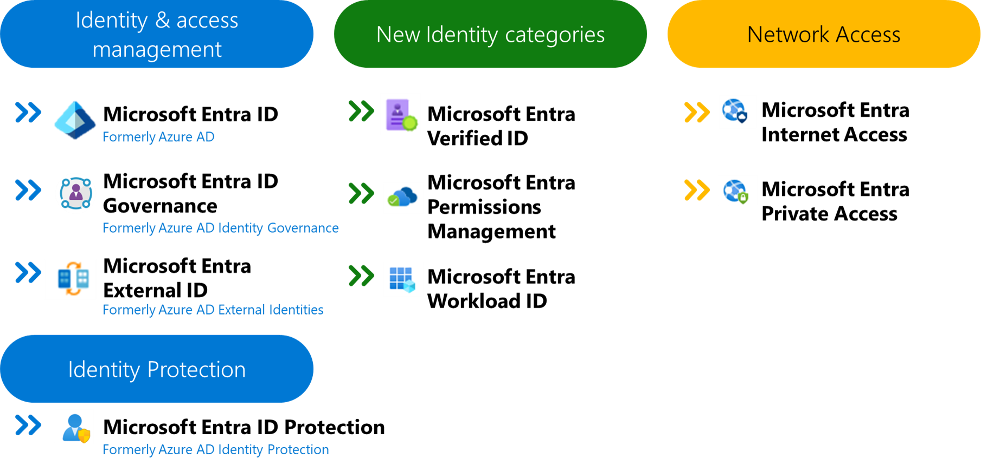
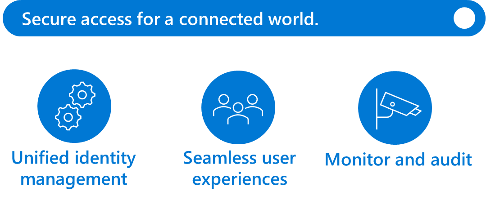

# Microsoft Entra ID Overview

## Microsoft Entra Overview - Identity and Access Management

### Today's digital landscape and its challenges

- ➡️ Rapid increase of identities that need to be protected

- ➡️ Accelerated growth of apps, on and off the corporate network, requiring secure access

- ➡️ Hybrid work requires seamless, flexible experience while keeping access secure

- ➡️ Identity attacks are on the rise—over 1,000 password attacks per second

- ➡️ Evolving regulations with data privacy and security implications

👉 세상이 단순했던 시절에는 디지털 접근 제어가 비교적 간단했습니다. 경계를 설정하고 적절한 사람만 출입을 허용하면 됐습니다. 하지만 관리하고 보호해야 할 ID(직원, 파트너, 고객, 워크로드)의 양이 급증하면서 단순히 경계를 설정하는 것만으로는 더 이상 지속 가능하지 않습니다.

ID 공격은 그 수와 수법 모두에서 증가하고 있습니다. 매초 1,287건의 비밀번호 공격이 발생하며, 하루에 1억 1,100만 건 이상이 발생합니다.1 작년 한 해 동안 비밀번호 유출 재실행 공격은 월 58억 건, 피싱 공격은 월 3,100만 건, 비밀번호 스프레이 공격은 월 500만 건으로 급증했습니다.

특히 조직의 통제 범위를 벗어난 타사 시스템, 플랫폼, 애플리케이션 및 장치를 포함하는 경우, 조직과 공급망 전반에서 발생할 수 있는 무수한 접근 시나리오를 예측하고 대응하는 것은 사실상 불가능합니다.

ID는 단순히 디렉터리에 관한 것이 아니며, 접근 제어는 네트워크에 관한 것만이 아닙니다. 보안 문제는 훨씬 더 광범위해졌으므로, 더 포괄적인 솔루션이 필요합니다. 모든 고객, 파트너, 직원뿐 아니라 모든 마이크로서비스, 센서, 네트워크, 장치 및 데이터베이스에 대한 액세스를 보호해야 합니다.

✅ **References**

1. https://intelequia.com/en/blog/post/microsoft-security-copilot-how-does-it-help-you-protect-your-data
2. https://www.microsoft.com/en-us/security/blog/2023/01/09/microsoft-entra-5-identity-priorities-for-2023/

_Figure 1: Growth in password-related attacks between 2018 and 2022._

### Microsoft Entra - Secure access for a connected world

>**Legend:**
>
>ML = Machine Learning
>
>AI = Artificial Intelligence

Microsoft의 솔루션은 다음과 같은 목표를 달성하도록 설계되었습니다.:

- ➡️ **어디에서든 모든 앱과 리소스에 안전하게 액세스:** 통합되고 적응형인 ID 및 네트워크 액세스 제어를 활용하여 전체 환경에서 모든 사용자 또는 디지털 워크로드에 대해 모든 앱이나 리소스에 대한 액세스를 안전하게 보호하세요.

- ➡️ **모든 ID 보호 및 검증:** 직원, 현장 작업자, 고객, 파트너를 포함한 모든 사용자는 물론 멀티클라우드 및 하이브리드 환경 전반의 앱, 장치 및 워크로드에 대해 일관된 보안 정책을 구현하세요.

- ➡️ **필요한 액세스만 제공:** 제로 트러스트의 최소 권한 액세스 원칙에 따라 적시 액세스, 필요한 만큼의 액세스, 위험 기반 적응형 정책 및 권한 관리를 통해 데이터와 생산성을 모두 안전하게 보호할 수 있습니다.

- ➡️**사용자 경험 간소화:** 모든 리소스에 원활하게 액세스할 수 있도록 하이브리드 근무 환경의 사용자 경험을 개선하세요. 간편한 로그인으로 고객 만족도를 높이세요. 자동화된 라이프사이클 워크플로 및 사용자 셀프 서비스 관리를 통해 ID 관리팀의 업무 부담을 줄이세요.

이를 위해 Microsoft는 오늘날의 과제에 대응하기 위해 ID 비전을 지속적으로 발전시키고 있습니다. Microsoft는 2000년 Microsoft 전용 디렉터리 서비스로 시작했습니다. 컴퓨팅 및 보안 환경이 발전함에 따라 Microsoft 엔트라(Microsoft Entra)도 함께 발전해 왔습니다. 2015년, Microsoft는 클라우드 컴퓨팅의 발전에 대응하여 액세스 제어 평면(Access Control Plane)을 선보였습니다. 이제 Microsoft는 보안 및 ID를 트러스트 패브릭(Trust Fabric)이라는 개념으로 접근합니다. 이는 지구상의 모든 사람과 모든 '스마트' 사물에 ID 서비스를 제공하는 수단입니다.

ID, 엔드포인트, 리소스 및 네트워크 전반에 걸친 통합적인 보안 액세스 솔루션을 통해 조직은 기존 네트워크 액세스 방식의 성능 저하를 야기하는 액세스 정책의 허점과 구성 문제를 해결할 수 있습니다. 온프레미스, 클라우드 환경, 그리고 그 사이의 모든 곳에서 모든 ID를 보호하고 모든 리소스에 대한 액세스를 안전하게 관리하세요.

Microsoft Entra는 기존의 ID 관리 방식을 뛰어넘어 멀티클라우드 및 멀티플랫폼 환경에서 모든 사람이 모든 것에 안전하게 액세스할 수 있도록 지원하는 완벽한 툴셋을 제공합니다.

### Microsoft Entra Product Family

>**Legend:**
>
>Microsoft Entra Connect = Azure AD Connect
>
>Microsoft Entra ID (formerly Azure Active Directory, or Azure AD)

Microsoft Entra 제품군을 통해 Identity와 Access에 대한 확장된 비전을 제공합니다.

Microsoft Entra 제품군은 다음과 같이 구성됩니다:

- ➡️ **Microsoft Entra ID**(이전의 Azure Active Directory 또는 Azure AD)
사용자를 앱, 디바이스 및 데이터에 연결하는 신원 및 액세스 관리 솔루션으로 조직을 보호하세요. 업그레이드된 이름 변경만으로도 이전과 동일한 기능을 제공합니다.

- ➡️ **Microsoft Entra ID Governance**는 조직 및 규제 요구 사항을 준수하는 동시에 실시간, 셀프 서비스 및 워크플로우 기반 앱 권한을 통해 직원 생산성을 높이는 데 도움이 되는 완전한 신원 거버넌스 솔루션입니다. 이 솔루션은 직원 신원 라이프사이클을 자동화하여 IT의 수작업을 줄이고 신원 및 앱 권한에 대한 AI 기반 인사이트를 제공합니다. 클라우드로 제공되므로 기존의 온프레미스 신원 거버넌스 포인트 솔루션과 달리 복잡한 클라우드 및 하이브리드 환경으로 확장할 수 있습니다. Microsoft 및 기타 앱 제공업체의 클라우드 및 온프레미스 앱을 지원합니다.

- ➡️ **Microsoft Entra External ID**는 고객, 환자, 시민, 게스트, 파트너 및 공급업체를 포함한 외부 사용자를 애플리케이션으로 인증하기 위한 통합 플랫폼입니다. 클라우드에 구애받지 않고 개발자 친화적인 이 플랫폼은 로그인/가입 경험, 조건부 액세스 신원 보호, 소셜 신원 제공자 지원을 위한 풍부한 사용자 지정 옵션을 제공합니다. Azure의 광범위한 보안 및 규정 준수 기능을 사용하여 최종 사용자를 위한 안전한 환경을 조성합니다. Microsoft Entra 제품군 기술 솔루션의 일부로, 외부 ID에는 포괄적인 통합 신원 기능 세트가 포함되어 있습니다.

- ➡️ **Microsoft Entra ID Protection**은 고급 머신 러닝을 사용하여 로그인 위험과 비정상적인 사용자 행동을 식별하여 액세스를 차단, 도전, 제한 또는 허용합니다.
악성 행위자로부터 보호하기 위해 위험 기반 적응형 접근 정책을 확장하여 신원 침해를 방지합니다. 
고신뢰 인증 방법을 사용하여 민감한 접근을 보호함으로써 자격 증명 도용으로부터 보호합니다.
Microsoft 또는 기타 보안 정보 및 이벤트 관리(SIEM)와 확장 탐지 및 응답(XDR) 도구에 대한 인텔리전스를 다시 탐색하여 신원 보안 자세에 대한 인사이트를 심화하고 추가 조사를 진행합니다.

- ➡️ **Microsoft Entra Verified ID**는 신원 확인 솔루션을 통해 개인정보 보호를 위한 분산 신원 증명을 생성, 발급 및 검증할 수 있으며, 이를 통해 누구와도 보다 안전한 상호작용을 가능하게 합니다.

- ➡️ **Microsoft Entra Permissions Management**는 클라우드 인프라 자격 관리(CIEM) 솔루션을 통해 멀티 클라우드 인프라 전반에 걸친 권한 위험을 발견, 업데이트 및 모니터링할 수 있습니다.

- ➡️ **Microsoft Entra Workload ID**는 업계 최고의 솔루션을 통해 앱과 서비스에 대한 안전한 액세스, 위험 감지 및 신원 관리가 가능합니다.

- ➡️ **Network Access** (**Global Secure Access**)는 새로운 서비스이며 Microsoft의 **Security Service Edge (SSE)** solution입니다. 하이브리드 원격 작업이 새로운 표준이 되고 클라우드 워크로드가 증가함에 따라 이제 액세스 관리를 재고할 때입니다. 기존의 네트워크 액세스 접근 방식은 복잡하고 일관성 없는 액세스 제어, 보안 격차, 열악한 사용자 경험으로 이어졌습니다. 우리는 신원 제어와 네트워크 제어가 협력하여 어떤 관리자도 신원과 자원을 보호하기 위해 여러 정책을 관리해서는 안 된다고 믿습니다. 그렇기 때문에 Microsoft Entra는 신원, 엔드포인트, 리소스 및 네트워크에 걸쳐 조건부 액세스 제어를 통합하여 보안 액세스를 재창조하고 있습니다. 조직은 전체적인 보안 액세스 솔루션을 통해 기존 접근 방식의 성능에 부담을 주는 액세스 정책 격차와 구성 문제를 제거할 수 있습니다. **Network Access** (**Global Secure Access**) 내에는 두 가지 제품이 있습니다: Microsoft Entra Internet Access와 Microsoft Entra Private Access.

    - ➡️ **Microsoft Entra Internet Access**
    
        제로 트러스트 원칙을 유지하면서 하이브리드 인력을 위한 모든 인터넷 앱과 리소스에 안전하고 신속하며 신원 중심의 액세스를 제공합니다. 
    
    - ➡️ **Microsoft Entra Private Access**
    
        원격 사용자를 모든 기기와 네트워크에서 온프레미스, 클라우드, 그 사이의 모든 곳에 있는 개인 앱에 빠르고 안전하게 연결할 수 있습니다.

✅ **References**

- **Security Service Edge (SSE):**

    사람들이 일하는 방식이 변함에 따라 전통적인 사무실에서 일하는 대신, 사람들은 이제 거의 어디서든 일할 수 있습니다. 애플리케이션과 데이터가 클라우드로 이동함에 따라, 현대 인력은 신원 인식(identity-aware)과 클라우드 기반 네트워크 경계가 필요합니다. 이 새로운 네트워크 보안 카테고리는 보안 서비스 엣지(SSE)라고 불립니다.

    **Microsoft Entra Internet Access**과 **Microsoft Entra Private Access**는 Microsoft의 **Security Service Edge(SSE)** 솔루션을 구성합니다. **Global Secure Access**은 **Microsoft Entra Internet Access**과 **Microsoft Entra Private Access**를 통칭하는 통합 용어입니다. 

    **Global Secure Access**은 **최소 권한 사용(least privilege)**, **명시적 검증(verify explicitly)**, **침해 전제(assume breach)** 제로 트러스트의 핵심 원칙 위에 구축되었습니다.

## Microsoft Entra ID 

>Secure access for a connected world.

빠른 로그인, 비밀번호 관리 시간 단축, 최종 사용자 생산성 향상을 통해 중앙 위치에서 모든 identity와 애플리케이션 접근성을 관리하고 제어하며 사용자 경험을 최적화합니다.

Microsoft Entra ID는 연결된 세계에 대한 액세스를 보호할 수 있는 기능을 갖춘 풀 기능 플랫폼을 제공합니다.

Microsoft Entra ID가 도와드릴 수 있습니다:

- ➡️ **원활한 사용자 경험(Seamless user experiences):** 쉽고 빠른 로그인 경험을 제공하여 사용자의 생산성을 유지하고 비밀번호 관리 시간을 단축하며 최종 사용자의 생산성을 높입니다. 

- ➡️ **통합 Identity 관리(Unified identity management):** 클라우드든 온프레미스든 중앙 위치에서 모든 신원과 애플리케이션에 대한 액세스를 관리하여 가시성과 제어력을 향상시킬 수 있습니다. 

- ➡️ **모니터링 및 감사(Monitor and Audit):** 모든 사용자와 관리자의 앱 및 데이터 액세스를 효율적으로 모니터링하고 감사하여 권한이 있는 사용자만 액세스할 수 있도록 합니다.

**Market Challenge**

조직은 보안을 제공하고 사용자 인증을 간소화하며 리소스에 대한 안전한 액세스를 가능하게 하는 하이브리드 및 클라우드 환경 전반에 걸친 포괄적인 IAM 솔루션이 필요합니다.

